# Building Generative AI Applications and Workflows with Amazon Bedrock

**Project Links:**
- Part 1: [Build an AI Chatbot with Amazon Bedrock](http://learn.nextwork.org/projects/aws-genai-bedrock-chatbot)
- Part 2: [AI Finance Agent with Amazon Bedrock](http://learn.nextwork.org/projects/aws-genai-bedrock-agent)
- Part 3: [AI Email Router with Bedrock Flows](http://learn.nextwork.org/projects/aws-genai-bedrock-flows)

---

## Series Overview

In this hands-on series, I built a complete suite of cloud-based Generative AI applications and visual workflows on Amazon Web Services (AWS) using Amazon Bedrock. 

Throughout these projects, I developed:
1.  A stateful, multi-turn AI chatbot with customized system instructions and inference configuration.
2.  An AI Finance Agent equipped with a Code Interpreter to programmatically parse CSV spending datasets, analyze traces, and recall data across sessions using persistent memory.
3.  A visual AI Email Router utilizing Bedrock Flows to automatically classify incoming emails and direct them to custom, context-specific response prompts.
4.  Standardized security policies across all projects using Bedrock Guardrails to filter out harmful user prompts and model completions.

---

# Part 1: Build an AI Chatbot with Amazon Bedrock

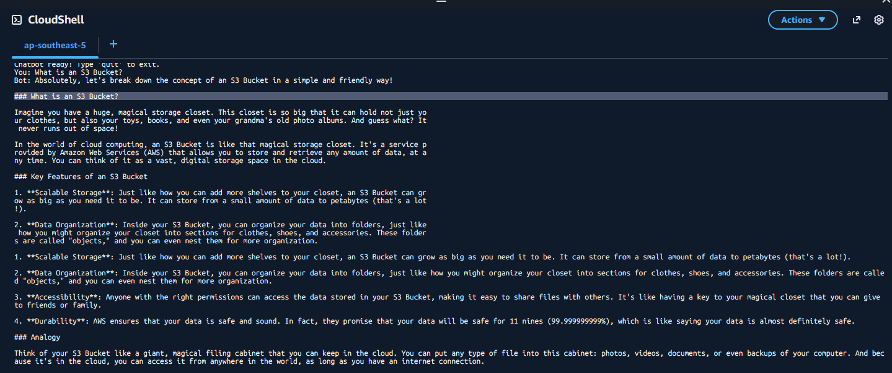

In this phase, I established the foundation of my generative AI skills by launching a chatbot directly through AWS.

### Discovering Amazon Bedrock and Foundation Models
Amazon Bedrock is a fully managed service that provides access to high-performing foundation models (FMs) from top AI companies (including Amazon, Anthropic, Meta, and others) via a single unified API. This serverless architecture eliminates the need to manage backend GPUs or provision physical hosting infrastructure.

I navigated to the Bedrock Console and opened the **Chat Playground** to run initial test prompts against the **Amazon Nova 2 Lite** foundation model. Nova 2 Lite offers an excellent balance between low latency, quality reasoning, and cost-efficiency.

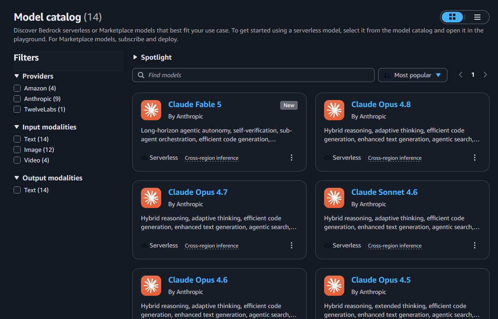

---

### Calling the Bedrock Converse API with Python
To build beyond the playground, I used AWS CloudShell to write a Python script that invokes Amazon Bedrock programmatically. 

Key details of this implementation include:
*   **Boto3 Client SDK**: I initialized the Bedrock runtime client using `boto3.client('bedrock-runtime')`.
*   **Structured Messages List**: I configured a `messages` array containing dicts that trace the conversation. Each entry specifies a `role` (such as `user` or `assistant`) and the text `content`.
*   **Statelessness vs. Session History**: Because large language models are stateless—meaning they do not inherently remember past prompts—maintaining conversation history requires appending past user prompts and assistant replies back into each subsequent API request.

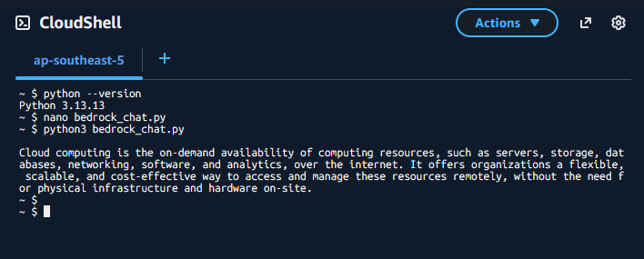

---

### Building a Stateful, Multi-Turn Chatbot
I expanded the one-shot script into an interactive terminal-based chatbot with advanced settings:
*   **System Prompt**: I defined a specific persona and behavioral boundaries for the bot, instructing it on how to frame answers, structure formatting, and maintain a professional tone.
*   **Inference Parameters**: I adjusted parameters in `inferenceConfig` to control the model's output quality:
    *   *Temperature*: Tuned to balance creative responses with structured predictability.
    *   *Max Tokens*: Capped to manage costs and prevent excessively long replies.

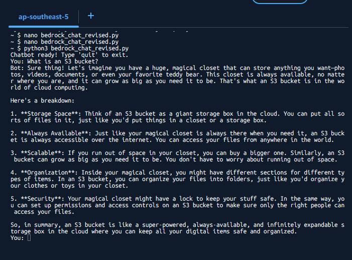

---

### Securing the Chatbot with Bedrock Guardrails
To implement responsible AI safety boundaries, I added a safety layer using **Bedrock Guardrails**:
*   I enabled content filters to detect hate speech, insults, sexual content, and violence.
*   I attached the guardrail configuration directly to my Converse API call in my Python script.
*   To verify the integration, I simulated a toxic user request. The guardrail immediately intercepted the prompt and returned a standard, predefined block message rather than sending the request to the foundation model, keeping the application safe.

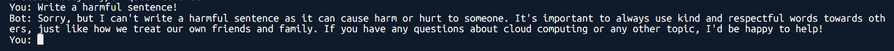

---

# Part 2: AI Finance Agent with Amazon Bedrock

In this project, I advanced from a simple prompt-response chatbot to a managed AI Agent capable of orchestrating complex reasoning, running code, and persisting memory.

### Chatbots vs. Bedrock Agents
*   A **Chatbot** is designed to take in prompt histories and generate text replies using static data or knowledge base lookups.
*   An **Agent** is a fully managed orchestrator. It uses a foundation model to break a complex user goal into logical steps, dynamically generates execution plans, calls external APIs, queries data sources, and runs code within secure containers to perform tasks on behalf of the user.

---

### Creating the Agent & Configuring Code Interpreter
I created an Amazon Bedrock Agent with a specialized persona: a personal finance advisor. 

I enabled the **Code Interpreter** capability. This feature allows the agent to dynamically write Python code, execute it within a secure, sandboxed container runtime on AWS, and parse the output. This capability is critical for executing math, handling CSV files, and rendering charts programmatically without relying on LLM text approximations.

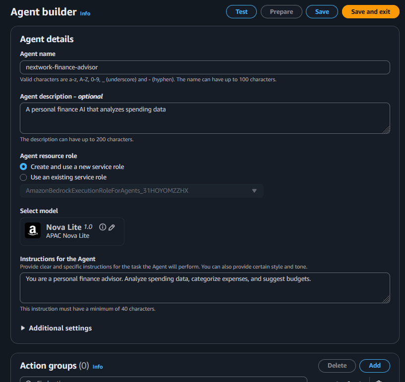

---

### Analyzing CSV Spending Data & Action Traces
To evaluate the agent, I uploaded a mock transactions CSV file:
1.  **Code Execution**: The agent automatically recognized the CSV payload, wrote Python code to parse and filter the transactions, and calculated financial summaries.
2.  **Debugging via Traces**: I used the EKS-like trace viewer to analyze the agent's step-by-step reasoning cycle. Traces show the exact thought process, tool invocations, and parser outputs.
3.  **Prompt Iteration**: After analyzing the traces, I iterated on the system instructions, guiding the agent to format its final advice as clean markdown tables.

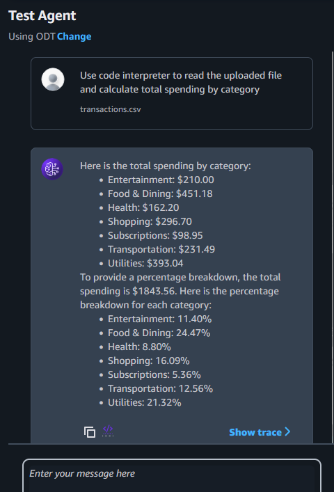

---

### Enabling Cross-Session Persistent Memory
Normally, agent sessions clear once closed. I enabled **Cross-Session Memory** to allow the agent to retain user context over long intervals:
*   **Session Summarization**: Instead of saving raw conversation logs which waste model context windows, Bedrock automatically distills historical sessions into high-level summaries of goals, files, and preferences.
*   **Testing Recall**: I opened a fresh session and asked the agent about my budget without uploading the CSV file again. The agent retrieved my spending records from its memory layer and successfully continued the financial review.

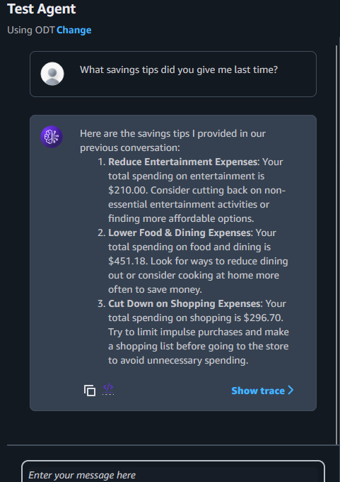

---

# Part 3: AI Email Router with Bedrock Flows

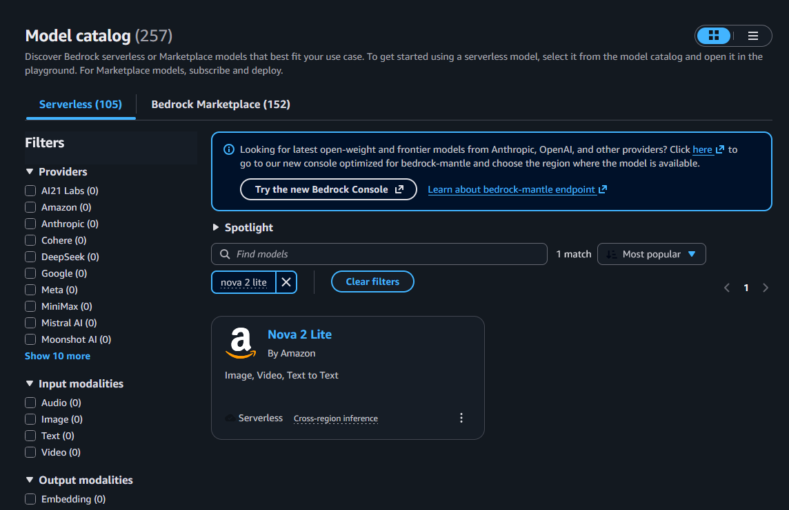

In this project, I built a visual, event-driven AI email routing pipeline using Amazon Bedrock Flows and Prompt Management.

### Prompt Management and intent Classification
I defined a reusable classifier prompt using **Bedrock Prompt Management**. Centralized prompt management allows developers to write, test, version, and share system prompts independently from application code.

My classifier prompt instructs the Nova model to analyze an incoming email and categorize its intent into one of three strict outputs: **Support**, **Sales**, or **Feedback**. The prompt is optimized to return *only* the single-word category label without any additional conversational text. This format is crucial because downstream condition nodes in the visual flow rely on clean string matching to direct the pipeline.

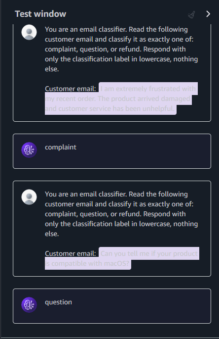

---

### Visual Orchestration with Bedrock Flows
Using the Bedrock Flows visual builder, I wired the email routing logic:
1.  **Input Node**: Receives the raw customer email content.
2.  **Classifier Prompt Node**: Evaluates the email text and outputs the classification tag.
3.  **Condition Node**: Checks the classifier's output. If the tag is "Complaint" (or matches Support/Sales parameters), it routes the flow to a specialized, empathetic response prompt.
4.  **Default/Fallback Path**: If the classification doesn't match specific rules (e.g., standard questions or general feedback), the condition node automatically routes the email to a general-purpose response prompt node.
5.  **Output Node**: Delivers the finalized AI-generated email response.

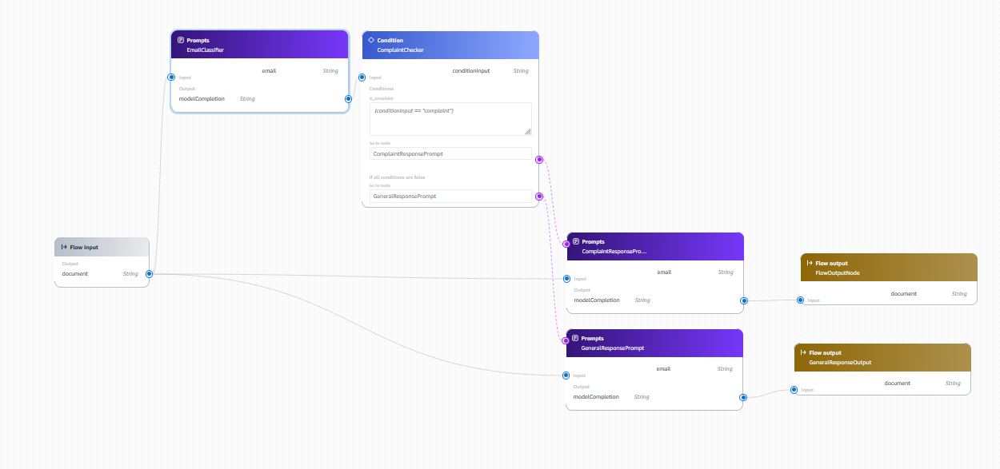

---

### Flow Testing and Upstream Content Safety
I tested the visual flow using the built-in trace debugger, checking how different email inputs traversed the pipeline:
*   A query email correctly routed to the general fallback responder node.
*   An email detailing a complaint successfully branched to the empathetic template node.
*   **Upstream Guardrail Filtering**: I attached a Bedrock Guardrail to the input node. When I simulated a harmful email containing toxic strings, the Guardrail blocked the input immediately. This prevented the message from reaching the classifier node, protecting downstream resources and saving model token costs.

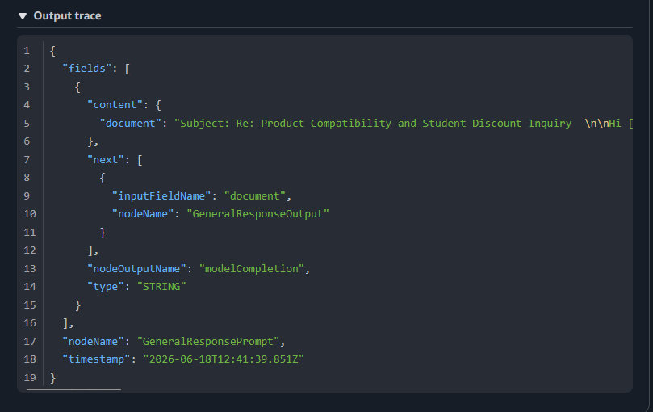

---

## Series Wrap-Up & Key Learnings

### Key Services & Tools Utilized
*   **Amazon Bedrock**: Centralized platform for accessing foundation models.
*   **Amazon Nova 2 Lite**: Used as the primary reasoning engine across the chatbot, agent, and visual flow.
*   **Bedrock Agents & Code Interpreter**: Allowed autonomous planning and execution of sandboxed Python code for CSV analysis.
*   **Bedrock Flows & Prompt Management**: Enabled drag-and-drop workflow orchestration and centralized, versioned prompts.
*   **Bedrock Guardrails**: Ensured upstream input and downstream output safety checks.

### Key Concepts Mastered
*   **Stateful Converse API Logic**: Simulating multi-turn memory in stateless models.
*   **Persona and Parameter Tuning**: Tweaking system prompts and inference bounds (temperature/tokens).
*   **Trace Debugging**: Walking through logical agent execution logs to improve performance.
*   **Conditional Routing**: Designing visual logic flows mapping user classifications to dedicated tasks.
