# Amazon EKS & Kubernetes: A Complete Journey from Cluster Setup to Backend Deployment

**Project Links:**
- Part 1: [Launch a Kubernetes Cluster](http://learn.nextwork.org/projects/aws-compute-eks1)
- Part 2: [Set Up Kubernetes Deployment](http://learn.nextwork.org/projects/aws-compute-eks2)
- Part 3: [Create Kubernetes Manifests](http://learn.nextwork.org/projects/aws-compute-eks3)
- Part 4: [Deploy Backend with Kubernetes](http://learn.nextwork.org/projects/aws-compute-eks4)

---

## Introducing the Series

In this series of projects, I set up a complete Kubernetes ecosystem on Amazon Web Services (AWS). Using tools such as Amazon EKS, Amazon EC2, Amazon ECR, AWS CloudFormation, AWS IAM, Docker, and `kubectl`, I containerized a Python Flask backend application, wrote declarative configurations to manage its scaling and lifecycle, and deployed it into a managed cloud environment. 

Through this journey, I built critical foundational skills in container orchestration, cloud-native networking, infrastructure as code (IaC), and identity access management.

---

# Part 1: Launching a Kubernetes Cluster

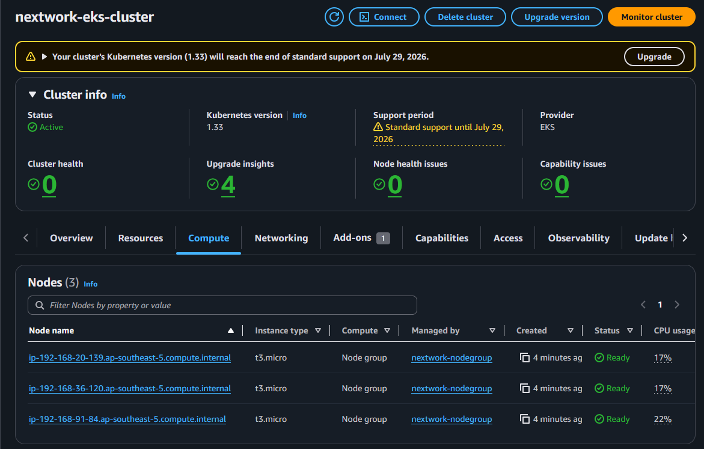

In this phase, I deployed the core infrastructure for a managed Kubernetes cluster using AWS resources.

### What is Kubernetes?
Kubernetes is an open-source container orchestration platform designed to automate the deployment, scaling, and management of containerized applications. Organizations use it to achieve high availability, scale workloads up or down dynamically, and coordinate microservices efficiently across distributed cloud environments.

To provision the cluster, I used `eksctl` (the official CLI tool for Amazon EKS) to automate the configuration and deployment. The command defines key cluster properties including:
*   The cluster's unique name.
*   The target AWS region for hosting.
*   The specific configurations for the worker nodes.

#### Troubleshooting CLI Installation and Permissions
During setup, I resolved two common errors:
1.  **Command Not Found**: The remote environment initially lacked the `eksctl` binary. I resolved this by installing `eksctl` directly onto the EC2 management instance.
2.  **IAM Authentication Failures**: The EC2 instance lacked the necessary IAM permissions to provision the underlying AWS infrastructure. I attached an IAM role containing administrative policies to authorize the instance to communicate with the AWS API.

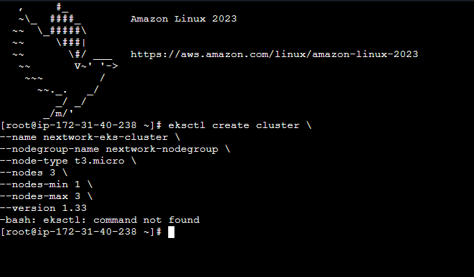

---

### Infrastructure as Code with eksctl and CloudFormation
Behind the scenes, `eksctl` uses AWS CloudFormation to orchestrate resource creation safely and predictably:
*   **Network Infrastructure Stack**: CloudFormation creates a new VPC, subnets, route tables, and internet gateways to isolate and route traffic securely between the EKS control plane and worker nodes.
*   **Node Group Stack**: A separate stack provisions the EC2 worker nodes that run the application containers.

#### Control Plane vs. Node Group
*   **The Cluster (Control Plane)** represents the master Kubernetes components (the API server, controller manager, schedulers, and configuration storage) that manage the cluster state.
*   **The Node Group** consists of the actual worker machines (EC2 instances) that join the cluster to execute the containerized workloads.

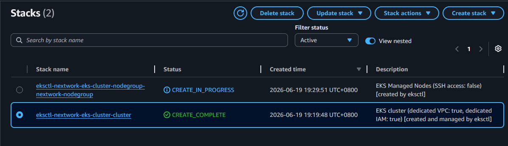

---

### EKS Console Access Setup
By default, EKS clusters restrict access to the creator. To view resources in the AWS Console, I configured an **IAM Access Entry**. This Amazon EKS feature maps AWS IAM principals (users/roles) directly to Kubernetes groups and Role-Based Access Control (RBAC) permissions without manually editing the internal Kubernetes `aws-auth` ConfigMap.

> [!NOTE]
> Creating an EKS cluster from scratch takes approximately 15–20 minutes. For repeated deployments, this process can be optimized by deploying worker nodes into pre-existing, reusable VPC infrastructure instead of provisioning a fresh network architecture each time.

---

### Extra: Deleting Worker Nodes and Pod Rescheduling
Since Amazon EKS runs standard EC2 instances behind the scenes to function as worker nodes, these instances are visible in the EC2 Console. 

When configuring a node group, we specify capacity boundaries:
*   **Desired Size**: The target number of active worker nodes the cluster should maintain under normal operations.
*   **Minimum and Maximum Sizes**: The boundaries for auto-scaling. The minimum size prevents the cluster from scaling below cost-efficient limits, while the maximum size prevents resource exhaustion during sudden traffic spikes.

If a worker node is manually deleted or goes offline:
1.  The EKS control plane detects the loss.
2.  The node's status is marked as lost or unavailable.
3.  Kubernetes automatically reschedules any active pods from the lost node onto the remaining healthy worker nodes, preventing service downtime.

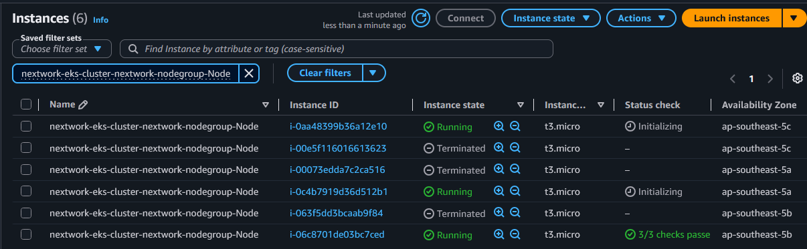

---

# Part 2: Setting Up the Deployment & Container Registry

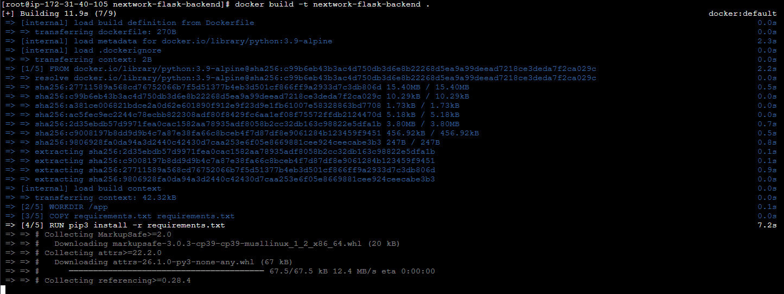

Before deploying to Kubernetes, the application code must be packaged into a portable container and stored in a registry that the cluster can access.

### Cloning and Inspecting the Flask Backend
I cloned the `nextwork-flask-backend` repository from GitHub onto my EC2 management instance. The application relies on three foundational files:
1.  `app.py`: Contains the core routing logic, endpoints, and server settings for the Flask web application.
2.  `requirements.txt`: Defines the exact Python packages and dependency versions required to run the server.
3.  `Dockerfile`: Details the step-by-step instructions for Docker to compile the code into an isolated image.

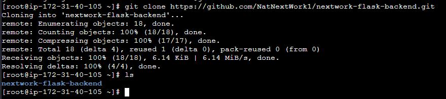

---

### Building the Docker Image and Troubleshooting Permissions
To package the application, I ran a Docker build. During this process, I encountered a common Linux permission error when interacting with the Docker daemon socket (`/var/run/docker.sock`). 

By default, non-root users cannot read or write to this socket. I resolved this issue by:
1.  Adding my current Linux user account to the system's `docker` security group.
2.  Restarting the terminal session to apply the group memberships.
3.  Re-executing the Docker build, successfully compiling the backend code and its dependencies into a clean, immutable image.

---

### Storing Images in Amazon ECR
To make the image accessible to EKS worker nodes, I pushed the compiled container image to Amazon ECR (Elastic Container Registry). 

Using a private registry like ECR is a best practice because:
*   It provides a centralized, secure location to host and version container images.
*   It integrates natively with Amazon EKS, allowing worker nodes to securely authenticate and pull images using AWS IAM roles, avoiding public exposure.

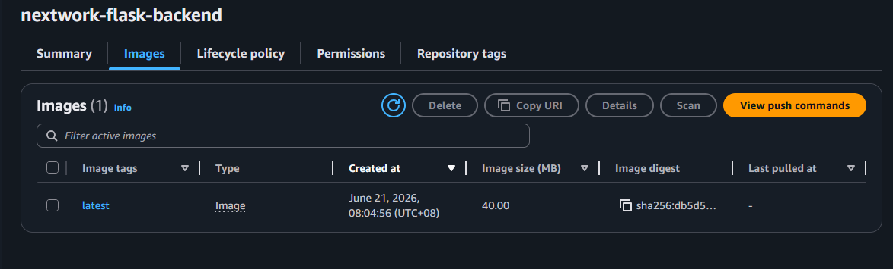

---

### Extra: Detailed Backend Code Breakdown

Here is a look at how the three primary files in the cloned repository configure our containerized environment:

#### 1. Requirements File (`requirements.txt`)
This manifest allows Python's package manager (`pip`) to recreate the exact environment required by the application:
```text
Flask==3.0.0
urllib3==2.1.0
```
Using strict versioning prevents breaking changes from new library updates and ensures consistency between development and runtime environments.

#### 2. Dockerfile (`Dockerfile`)
The Dockerfile dictates how Docker packages the server environment:
```dockerfile
FROM python:3.9-slim
WORKDIR /app
COPY requirements.txt .
RUN pip install --no-cache-dir -r requirements.txt
COPY . .
EXPOSE 5000
CMD ["python", "app.py"]
```
*   `FROM`: Sets the lightweight official Python runtime base.
*   `WORKDIR`: Configures the active working directory inside the container.
*   `COPY` & `RUN`: Copies the dependencies and installs them without caching to optimize file size.
*   `COPY . .`: Copies the remaining application code.
*   `EXPOSE`: Highlights that the container listens on port 5000.
*   `CMD`: Specifies the command to start the Flask web server.

#### 3. Application Code (`app.py`)
This file houses the backend application logic:
```python
from flask import Flask, jsonify

app = Flask(__name__)

@app.route('/')
def home():
    return jsonify(message="Welcome to the NextWork EKS Flask Backend API!")

@app.route('/health')
def health():
    return jsonify(status="healthy")

if __name__ == '__main__':
    app.run(host='0.0.0.0', port=5000)
```
The server routes requests arriving at `/` and `/health` endpoints and binds to host `0.0.0.0` so it can receive traffic from outside the container.

---

# Part 3: Creating Kubernetes Manifests

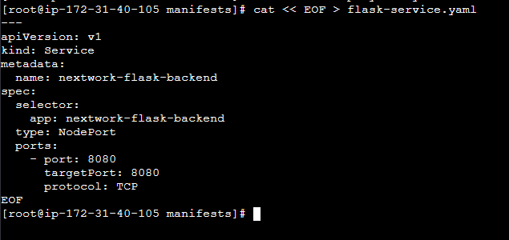

With the containerized image pushed to ECR, the next step is creating Kubernetes manifests to declare how the EKS cluster should deploy and network the application.

### What are Manifest Files?
Kubernetes manifests are declarative configuration files, typically written in YAML, that define the desired state of cluster resources. By using manifests, you manage infrastructure as code, ensuring application environments are repeatable, version-controlled, and easily shareable.

---

### The Service Manifest
A Kubernetes **Service** manages internal and external routing. It acts as a stable network access point (with a fixed IP and DNS name) mapping to a dynamic, changing pool of target pods.

My Service configuration maps external requests onto the underlying application instances:
*   It exposes port `80` (or `5000` depending on configuration) and directs traffic to the container port defined in the deployment.
*   It uses labels and selectors to target pods, opening communication channels so traffic flows into the active backend container deployment.

---

### The Deployment Manifest
A **Deployment** resource dictates how Kubernetes manages the lifecycle, updates, and scaling of your pods.

Key configurations in my Deployment manifest include:
*   **Replica Count**: The target number of identical pod instances to keep running for high availability and load distribution.
*   **Container Image URI**: Points directly to the private Amazon ECR repository address, instructing Kubernetes where to fetch the container image.
*   **Selectors**: Define how the deployment identifies the pods it is responsible for managing.

```yaml
apiVersion: apps/v1
kind: Deployment
metadata:
  name: flask-backend-deployment
  labels:
    app: flask-backend
spec:
  replicas: 2
  selector:
    matchLabels:
      app: flask-backend
  template:
    metadata:
      labels:
        app: flask-backend
    spec:
      containers:
      - name: flask-backend-container
        image: <YOUR_ECR_IMAGE_URI>
        ports:
        - containerPort: 5000
```

> [!TIP]
> Understanding the relationship between labels and selectors is crucial. The deployment's `matchLabels` must match the metadata labels of the pod template to bind them together, bridging your physical compute infrastructure with your application requirements.
>
> In production environments, exploring update strategies (such as rolling updates) and defining resource limits and readiness probes ensures that container upgrades happen smoothly without service interruptions.

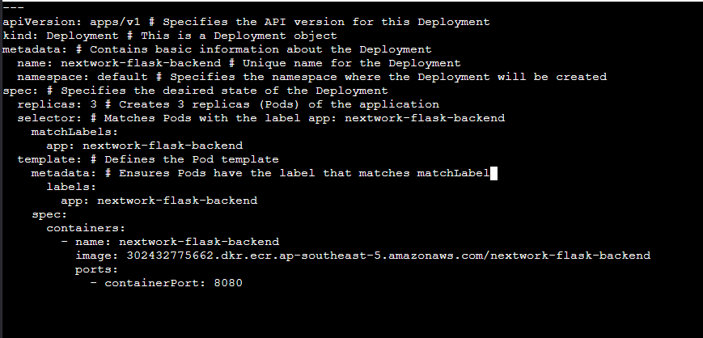

---

# Part 4: Deploying and Verifying the Backend

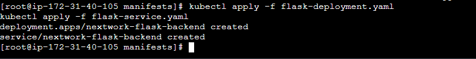

In the final phase, I deployed the manifests to the live Amazon EKS cluster and validated that the application was running properly.

### Deploying with kubectl
To apply the configurations, I used `kubectl`, the command-line tool for interacting with Kubernetes clusters. Applying the manifest files instructs the EKS control plane to pull the application image from Amazon ECR and run the containers as pods.

#### eksctl vs. kubectl
*   **`eksctl`** is an infrastructure tool. It is used to create and configure the EKS cluster, node groups, IAM roles, and AWS networking components.
*   **`kubectl`** is an application management tool. Once the cluster is running, `kubectl` is used to deploy resources (pods, services, deployments) and interact with the Kubernetes API server.

---

### Verifying the Deployment
To ensure that the application is running correctly, I verified the deployment status in the Amazon EKS Console.

#### Configuring IAM Console Visibility
By default, the AWS identity that creates the EKS cluster is the only user with admin permissions inside the cluster. To allow other AWS console users or roles to view Kubernetes resources (like pods, deployments, and services) in the EKS Console, I configured EKS **Access Entries**. This maps IAM roles or user policies to Kubernetes RBAC, granting permission to inspect resources via the console.

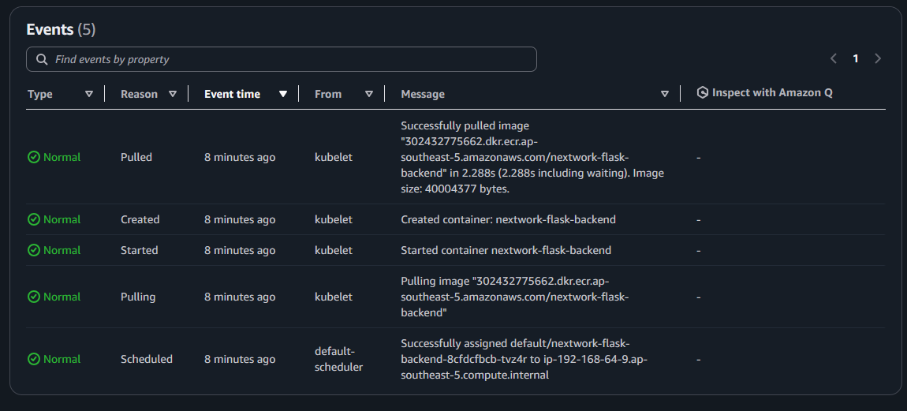

---

### Pods and Event Logs
Once console access was enabled, I verified the running state of the resources:
*   **Pods**: I confirmed that pods were running inside the worker nodes. A pod is the smallest deployable unit of computing in Kubernetes. Multiple containers within a single pod share the same network namespace (IP address and port range) and storage volumes, allowing them to communicate via localhost.
*   **Event Logs**: Inspecting the lifecycle event logs for the pods verified that EKS successfully:
    1.  Pulled the image from the private Amazon ECR repository.
    2.  Created the container instances.
    3.  Transitioned the containers into a healthy, running state.

Reviewing these events ensures that there are no scheduling constraints, authentication issues (such as image pull secrets errors), or application runtime crashes, confirming that the backend API is online and healthy.
