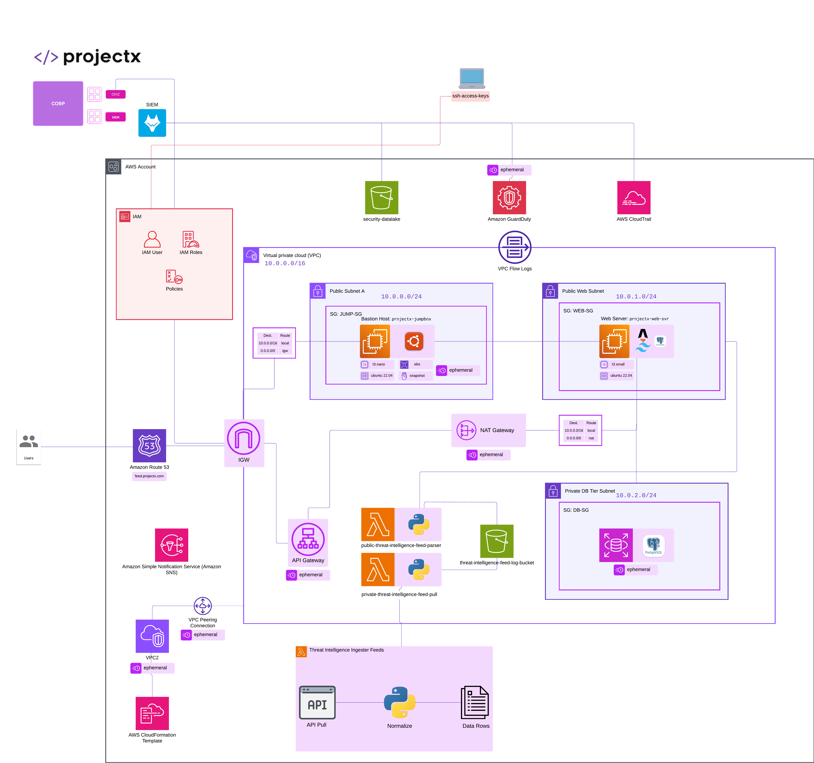

> **Disclaimer:** All IAM credentials, public IP addresses, and sensitive data shown in this writeup have been removed, and the entire AWS environment was securely cleaned up prior to publication.


# Cloud & Attacks 101 — Overview

## Welcome to the New Series

With Enterprise 101 and Networks & Attacks 101 wrapped up, it's time to move into the cloud.

**Cloud & Attacks 101 (CA101)** is the next core section in the Project Security curriculum. Where the previous two series focused on building and attacking an on-premises corporate network, CA101 shifts the environment to **Amazon Web Services (AWS)** — the most widely deployed cloud platform in the world and, consequently, one of the most targeted.

The goal of this series is the same as before: build something real, break it deliberately, and understand why it matters. Except this time, the "network" is a production-grade AWS environment with VPCs, EC2 instances, RDS databases, S3 buckets, IAM policies, and CloudTrail logging — the full stack you'd find in an actual company's cloud infrastructure.

> CA101 can be followed without completing E101 or NA101 first. However, a few detection scenarios in the defenses section rely on the Wazuh SIEM from E101 being integrated with AWS — so if you've been following along from the start, you'll get the most out of it.

### Figure 1 - Cloud Lab Architecture



> **Note on Topology:** The diagram above illustrates the complete, full-scale deployment plan. However, to keep this writeup focused and streamlined, several components shown in the diagram were intentionally skipped. The skipped sections include **Storage (EBS & AMIs)**, **Databases (RDS PostgreSQL & EC2 DB)**, **Serverless Pipeline (Lambda & API)**, **Messaging (SNS)**, and several defense mechanisms (GuardDuty, Secrets Manager). The lab focuses heavily on core Networking, IAM, Compute, and SIEM Logging integration.

## What's Different About Cloud Security

On-premises security and cloud security share the same fundamentals — least privilege, network segmentation, logging, patching — but the attack surface looks very different.

In a traditional on-prem environment, an attacker needs to get onto the network first. In a cloud environment, **misconfigurations are often directly internet-accessible**. A public S3 bucket, an overly permissive IAM policy, or an exposed API gateway can be discovered and exploited from anywhere in the world without the attacker ever touching your internal network.

The other major shift is **identity**. In a LAN, you worry about who's on the network. In AWS, you worry about who holds the keys — IAM credentials. A leaked access key in a GitHub repo or a hardcoded secret in source code can give an attacker the same level of access as a legitimate administrator. The blast radius of a credential compromise in AWS is significantly larger than in most on-prem environments.

This series covers both sides: how I built a properly structured production AWS environment, and how attackers exploit the gaps when it isn't.

## The Approach: Ad Hoc Attacks

One thing that's different in CA101 compared to E101 and NA101 is how the attack scenarios are structured.

In E101, I followed a full end-to-end attack lifecycle — reconnaissance through to persistence. In NA101, each attack mapped to a specific network protocol or layer. In CA101, the attacks are **ad hoc** — each scenario corresponds directly to a specific cloud attack tactic (the *why*) and technique (the *how*), without necessarily chaining them into a single kill chain.

This better reflects how cloud attacks actually happen in practice: an attacker finds a misconfigured S3 bucket independently of whether they've already compromised an EC2 instance. Each vulnerability stands on its own.

## What We're Building

The CA101 environment is a production-grade AWS deployment for the fictional company **Project X**. Here's everything that I provisioned across the series:

### Networking

| Resource | Function |
|---|---|
| projectx-prod-vpc | Main lab VPC for the ProjectX production environment |
| projectx-prod-igw | Internet gateway attached to the VPC |
| projectx-prod-public-subnet | Public subnet with a route to the internet gateway |
| projectx-prod-private-web-subnet | Private subnet for the application (web) tier |
| projectx-prod-private-db-subnet | Private subnet for the database tier |
| projectx-prod-public-rt | Route table for the public subnet |
| projectx-prod-private-rt | Route table for the private subnets |
| projectx-prod-nat-gw | NAT gateway for outbound internet access from private subnets |

### Compute

| Resource | Function |
|---|---|
| projectx-prod-jumpbox | Bastion EC2 instance for operator access into the private network |
| projectx-prod-jumpbox-sg | Security group rules for the jumpbox |
| projectx-prod-websvr | Primary web server EC2 instance |
| projectx-prod-websvr-sg | Security group for web server traffic |

### IAM

| Resource | Function |
|---|---|
| projectx-prod-admin | Dedicated IAM admin user |
| projectx-wazuh-s3-user | Service user for Wazuh to access the S3 datalake |
| projectx-wazuh-s3-read-policy | Custom policy for S3 datalake read access |

### Monitoring & Logging

| Resource | Function |
|---|---|
| projectx-prod-datalake-[username] | S3 bucket collecting security log archives |
| projectx-prod-management-trail | CloudTrail multi-region trail logging to S3 |
| projectx-prod-vpc-flow-logs | VPC Flow Logs delivery configuration |

### Attacks (Ephemeral — deleted after each exercise)

| Resource | Function |
|---|---|
| projectx-leaky-bucket | Misconfigured public S3 bucket |
| delete-me-ssrf-ec2 | Target EC2 for the metadata SSRF lab |
| insecure-api-gateway | CloudFormation stack for the insecure API enumeration lab |
| hardcoded-secrets | CloudFormation stack for the hardcoded secrets scenario |
| insecure-iam-permissions | CloudFormation stack for the IAM privilege escalation lab |

> Attack resources are deployed using **CloudFormation templates** provided in the exercise files and torn down immediately after each scenario — they're intentionally vulnerable, so nothing lingers.

---

## Exercise Files

Throughout CA101, I used exercise files for two things:

1. **CloudFormation templates** — deploying and tearing down ephemeral vulnerable infrastructure for the attack scenarios
2. **JSON detection files** — Wazuh Query DSL detection rules for the defenses section

All exercise files are available on GitHub:

```bash
git clone https://github.com/projectsecio/exercise-files.git
```

The relevant files for this series are under the `cloud-attacks-101` directory.

## Tools

### Defense & Enterprise

- **AWS CLI (`aws`)** — Configure accounts and profiles, query Secrets Manager, start SSM Session Manager sessions, manage S3 buckets and CloudTrail
- **CloudFormation** — Deploy and tear down stacks from the AWS Console, including the deliberately vulnerable attack templates
- **psql** — PostgreSQL client for admin checks, DDL/DML, and connectivity tests against RDS or EC2 Postgres
- **ssh-keygen** — Generate SSH key pairs for EC2 access

### Offense

- **s3scanner / bucket_finder** — Discover and probe publicly accessible S3 buckets
- **curl** — Fetch EC2 metadata, probe API Gateway routes, invoke exposed endpoints
- **amass / subfinder** — Subdomain enumeration to surface API Gateway–related hosts
- **gobuster** — Directory and file brute-force to uncover hidden paths and sensitive files
- **nmap / masscan / zmap** — Port and service scanning against public IPs
- **jq** — Parse and filter JSON responses from API Gateway
- **wget** — Download tooling archives onto the attacker or lab host

## What's Coming in This Series

Here's the full scope of what CA101 covers, in order:

**Setup & Basics**
- I signed up for AWS, created an IAM admin user, configured the AWS CLI, generated an SSH key pair, and spun up a first EC2 instance to get comfortable with the environment

**Networking**
- I built the full `projectx-prod-vpc` with public and private subnets, an internet gateway, NAT gateway, and route tables

**Compute**
- I deployed a jumpbox (bastion host) and the production web server, with properly scoped security groups

**Monitoring & Logging**
- I built an S3 security datalake, configured CloudTrail and VPC Flow Logs, and integrated everything with Wazuh for cross-environment SIEM visibility

**Attacks** (five scenarios)
1. Misconfigured S3 Bucket
2. Metadata SSRF Attack on EC2
3. Insecure API Gateway
4. Hardcoded Secrets in AWS
5. Insecure IAM Permissions

**Defenses**
- AWS Config compliance rules


## NA101 Infrastructure (Optional)

If you have the NA101 environment still running, the `sec-box` and `attacker` from that series can be connected to the AWS environment during the defenses section to enable hybrid detection scenarios — cloud logs feeding into the on-prem SIEM.

This is optional but recommended if you've been following the full series.

---

*Let's get into it — starting with the IAM admin and SSH setup.*

*Next up — Part 2: IAM Admin User, AWS CLI & SSH Key Pair Setup.*
