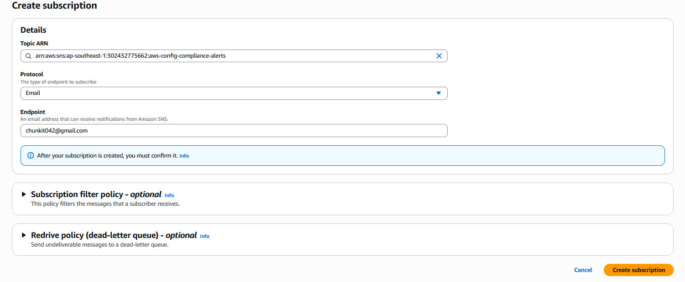
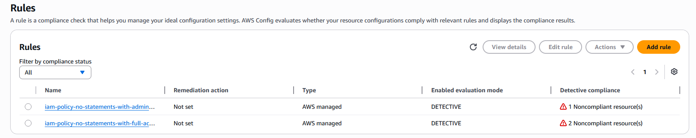

> **Disclaimer:** All IAM credentials, public IP addresses, and sensitive data shown in this writeup have been removed, and the entire AWS environment was securely cleaned up prior to publication.


# Defense — AWS Config for IAM Compliance

## Prerequisites

Before starting, I made sure the following were in place:

1. `projectx-prod-vpc` has been created with subnets configured
2. `My-Desktop-Key-Pair` key pair exists
3. AWS CLI configured with `projectx-prod-admin` credentials

> 📝 This guide defends against the **Insecure IAM Permissions** attack scenario (Attack 5). The Config rules we create detect the exact misconfigurations used in that exercise — overly permissive admin roles with `Action: *`, wildcard service permissions like `s3:*` and `ec2:*`, and the conditions that enable PassRole escalation.

---

## Overview

### What is AWS Config?

**AWS Config** is a service that continuously records the configuration state of your AWS resources and evaluates them against rules you define. Think of it as a compliance auditor that never sleeps — it watches every resource in your account, tracks how its configuration changes over time, and flags anything that violates your defined standards.

When a resource violates a rule, Config records a **compliance finding** — marking the resource as `NON_COMPLIANT`. It can then notify you via Amazon SNS, trigger automatic remediation via AWS Systems Manager, or feed findings into Security Hub for centralised visibility.

Three things make AWS Config valuable for IAM security:

- **Continuous evaluation** — it doesn't just check once. Every time an IAM policy is created or modified, Config re-evaluates it against the rules automatically
- **Historical configuration timeline** — Config maintains a full history of every configuration change, so you can see exactly when a policy became overly permissive and who made the change
- **Managed rules** — AWS provides a library of pre-built rules covering hundreds of common security misconfigurations, including the IAM checks we're implementing here

### How Config Relates to the IAM Attack

In Attack 5, the `admin` role had `Action: *, Resource: *` — effectively full administrative access. The wildcard EC2 role had `s3:*` and `ec2:*` on `Resource: *`. These are exactly the patterns the two rules we're adding are designed to catch.

Had Config been running when those roles were created, the resources would have immediately shown as `NON_COMPLIANT` and an SNS alert would have fired — giving us the chance to remediate before an attacker discovered and exploited them.

---

## Step 1 — I created the SNS Topic

AWS Config needs an SNS topic to deliver compliance notifications. We create a dedicated topic for Config alerts and subscribe an email address to receive them.

I navigated to **Amazon SNS → Topics → Create topic**.

I configured:

- **Type:** Standard
- **Name:** `aws-config-compliance-alerts`

I selected **Create topic**.


### I added an Email Subscription

On the topic page, select **Create subscription**.

I configured:

- **Topic ARN:** Select `aws-config-compliance-alerts`
- **Protocol:** Email
- **Endpoint:** Your email address

I selected **Create subscription**.

AWS will send a confirmation email to that address. Open it and click **Confirm subscription** before proceeding — SNS will not deliver messages to an unconfirmed endpoint.



---

## Step 2 — Enable AWS Config

I navigated to **AWS Config → Getting started** (or **Settings** if Config has been partially configured before).

### Recording Method

- **Recording method:** Specific resource types
- **Resource types to record:** I selected **All globally recorded IAM resources** — or narrow to `AWS::IAM::*` if you want to limit Config's scope to IAM only

> Limiting to IAM resources reduces the number of configuration items recorded and keeps costs down for a homelab. In a production environment you'd record all resource types and accept the higher storage cost for complete visibility.

- **Delivery frequency:** Daily

### Delivery Method

- **Amazon S3 bucket:** Create a new bucket or select your existing datalake bucket (`projectx-prod-datalake-[username]`). Routing Config snapshots to the datalake means you could eventually build Wazuh detections on Config compliance data too.
- **SNS topic:** Select `aws-config-compliance-alerts`

I selected **Confirm** twice to complete the setup.


> 📝 Config will begin recording IAM resource configurations immediately after enabling. It may take a few minutes to discover and evaluate all existing IAM resources for the first time.

---

## Step 3 — Add IAM Config Rules

I navigated to **AWS Config → Rules → Add rule**.

We're adding two managed rules that directly target the IAM misconfigurations from Attack 5.

### Rule 1 — iam-policy-no-statements-with-admin-access

**What it detects:** IAM policies that grant full administrative access — either through the `AdministratorAccess` managed policy or through a custom policy with `Action: "*"` and `Resource: "*"`. This is exactly the `admin` role from Scenario 1.

Search for `iam-policy-no-statements-with-admin-access` and select it.

- **Rule name:** `iam-policy-no-statements-with-admin-access`
- Leave all parameters as default

I selected **Save**.


---

### Rule 2 — iam-policy-no-statements-with-full-access

**What it detects:** IAM policies that grant full access to any individual AWS service — for example `s3:*` or `ec2:*` on `Resource: "*"`. This catches the wildcard EC2 instance role from Scenario 2 that gave full S3 and EC2 access.

I selected **Add rule** again.

Search for `iam-policy-no-statements-with-full-access` and select it.

- **Rule name:** `iam-policy-no-statements-with-full-access`
- Leave all parameters as default

I selected **Save**.


After both rules are saved, Config will evaluate all existing IAM policies against them. Any policy with admin-level or service-wildcard permissions will show as `NON_COMPLIANT`.

---

## Step 4 — Configure Near-Real-Time SNS Notifications via EventBridge

AWS Config sends a daily snapshot to SNS by default — which means a new `NON_COMPLIANT` resource might not trigger a notification until the following day. For a homelab this is acceptable, but for anything production-facing you want near-real-time alerting.

**Amazon EventBridge** lets us react immediately to Config compliance change events as they happen, forwarding them to SNS the moment a resource becomes non-compliant.

I navigated to **Amazon EventBridge → Rules → Create rule**.

I configured:

- **Name:** `config-compliance-to-sns`
- **Rule type:** Event pattern

Under **Event pattern**, select:

- **Event source:** AWS services
- **AWS service:** Config
- **Event type:** Config Rules Compliance Change

Then switch to the JSON editor and replace the pattern with:

```json
{
  "source": ["aws.config"],
  "detail-type": ["Config Rules Compliance Change"],
  "detail": {
    "configRuleName": [
      "iam-policy-no-statements-with-admin-access",
      "iam-policy-no-statements-with-full-access"
    ],
    "newEvaluationResult": {
      "complianceType": ["NON_COMPLIANT"]
    }
  }
}
```

What this pattern does:
- Matches only events from `aws.config`
- Scopes to the two specific rules I created — not all Config rules
- Fires only when the new compliance status is `NON_COMPLIANT` — not on every evaluation


### Add the SNS Target

Under **Select targets**, choose **SNS topic** and select `aws-config-compliance-alerts`.

I selected **Create rule**.


When any IAM policy triggers either rule as `NON_COMPLIANT`, EventBridge forwards the full compliance change event to SNS, and your subscribed email address receives a notification within seconds.

---

## Step 5 — I verified the Setup

### Trigger a Non-Compliant Resource

The easiest way to verify the full pipeline is to deploy the **Insecure IAM Permissions** CloudFormation stack from Attack 5. The `admin` role (with `Action: *`) and the wildcard EC2 role (with `s3:*`, `ec2:*`) will immediately register as `NON_COMPLIANT` against both rules.

```bash
# Deploy the stack (see Attack 5 guide)
aws cloudformation create-stack \
  --stack-name insecure-iam-permissions \
  --template-body file://insecure_iam_permissions.yaml \
  --parameters ParameterKey=KeyPairName,ParameterValue=My-Desktop-Key-Pair \
  --capabilities CAPABILITY_NAMED_IAM \
  --region ap-southeast-1
```

### Check Compliance Results in Config

I navigated to **AWS Config → Rules**.

The compliance status is displayed directly in the Detective compliance column. As shown in the screenshot, both configured IAM policy rules detected noncompliant resources:

- `iam-policy-no-statements-with-admin-access` detected 1 Noncompliant resource.
- `iam-policy-no-statements-with-full-access` detected 2 Noncompliant resources.

> 📝 Config evaluations can take several minutes to several hours to complete on first run. If results don't appear immediately, check back in 15–30 minutes.



### Check for SNS Email

If EventBridge and SNS are configured correctly, you should receive an email notification containing the compliance change event JSON within a few minutes of the stack deploying.


---

## Cleanup

> AWS Config charges per configuration item recorded and per rule evaluation. Disable Config and delete associated resources when you're done with the lab to avoid ongoing charges.

**Steps to clean up:**

1. **Delete the EventBridge rule:** EventBridge → Rules → select `config-compliance-to-sns` → Delete
2. **Delete Config rules:** AWS Config → Rules → select each rule → Delete rule
3. **Turn off Config recording:** AWS Config → Settings → Edit → turn off recording → Save
4. **Delete the SNS topic:** SNS → Topics → select `aws-config-compliance-alerts` → Delete
5. **Empty and delete the Config S3 bucket** if a new one was created during setup

---

## Summary

AWS Config is now set up to provide continuous IAM compliance monitoring:

| Component | Details |
|---|---|
| SNS Topic | `aws-config-compliance-alerts` — email subscription confirmed |
| Config Recording | IAM resources, daily delivery to S3 datalake |
| Rule 1 | `iam-policy-no-statements-with-admin-access` — flags `Action: *` policies |
| Rule 2 | `iam-policy-no-statements-with-full-access` — flags `s3:*`, `ec2:*` etc. |
| EventBridge Rule | `config-compliance-to-sns` — real-time SNS alerts on NON_COMPLIANT changes |

The combination of reactive Wazuh monitors (CloudTrail Detections) and proactive compliance rules (AWS Config) gives us two complementary defence layers for IAM:

- **Config** catches the misconfiguration the moment it's created — before any attacker finds it
- **CloudTrail/Wazuh** catches the exploitation — if the misconfiguration exists and is being abused

Neither layer alone is sufficient. Both together significantly raise the cost of a successful IAM-based attack.

---

*Next up — Part 16: Tear Down and Cleanup.*
