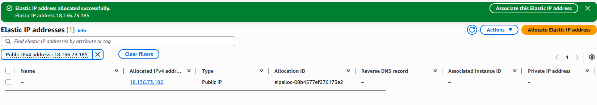

> **Disclaimer:** All IAM credentials, public IP addresses, and sensitive data shown in this writeup have been removed, and the entire AWS environment was securely cleaned up prior to publication.


# Networking — Setting Up the ProjectX Production VPC

## Prerequisites

Before starting, I made sure the following were in place:

1. An active AWS account
2. An IAM admin user created and configured
3. AWS CLI installed and configured with your admin credentials
4. A browser open and logged into the AWS console

---

## Overview

### What is Amazon VPC?

**Amazon Virtual Private Cloud (VPC)** is a logically isolated section of the AWS Cloud where you launch your AWS resources in a virtual network you define. You have complete control over your virtual networking environment — IP address ranges, subnets, route tables, and gateways.

Think of it like carving out your own private data centre inside AWS. Nothing gets in or out unless you explicitly allow it.

### Foundational Components

Before building, here's a quick rundown of the core VPC components I'll be working with:

**VPC (Virtual Private Cloud)**
The foundational networking container. A VPC spans an entire AWS Region and is divided into Availability Zones for high availability. Everything we deploy — EC2 instances, RDS databases, load balancers — lives inside a VPC.

**Subnets**
A subnet is a range of IP addresses within the VPC. Subnets let you segment the network by function and access level:
- **Public Subnet** — has a route to an Internet Gateway (IGW). Resources here can directly reach and be reached from the internet.
- **Private Subnet** — no direct route to the internet. Resources here require a NAT Gateway for outbound access and are not directly reachable from the public internet.

**Security Groups**
Stateful virtual firewalls that control inbound and outbound traffic at the **instance level**. Stateful means if you allow inbound traffic, the return traffic is automatically allowed. All traffic is denied by default.

**Network ACLs (NACLs)**
Stateless firewalls that operate at the **subnet level**. Unlike security groups, NACLs require explicit rules for both inbound and outbound traffic. Rules are evaluated in order by rule number. The default NACL allows all traffic.

**Route Tables**
Control where network traffic is directed inside and outside the VPC. Each subnet must be associated with a route table. By default, a VPC only has local routes — traffic between subnets stays inside the VPC, but nothing reaches the internet until you attach a gateway.

**Internet Gateway (IGW)**
Enables resources in public subnets to communicate with the internet. Attach one to a VPC and add a route pointing `0.0.0.0/0` to it from the public route table.

**NAT Gateway**
Enables resources in private subnets to initiate outbound connections to the internet (for package updates, API calls, etc.) without being directly reachable from the internet. The NAT Gateway lives in the public subnet and handles the address translation.

---

## What I'm Building

The architecture for my setup:

```
projectx-prod-vpc (10.0.0.0/16)
│
├── projectx-prod-public-subnet     (10.0.0.0/24)  → Internet Gateway
│       └── Jumpbox (Bastion Host)
│       └── NAT Gateway
│
├── projectx-prod-private-web-subnet (10.0.1.0/24) → NAT Gateway
│       └── Web Server (EC2)
│
└── projectx-prod-private-db-subnet  (10.0.2.0/24) → NAT Gateway
        └── RDS PostgreSQL
```

The public subnet faces the internet via the IGW. The private subnets have no direct internet exposure — they reach out only through the NAT Gateway for updates and outbound calls.

---

## Step 1 — Create the VPC

I navigated to the **VPC** service in the AWS Console.

I selected **Create VPC** → **VPC only**.

I configured the VPC:

- **Name tag:** `projectx-prod-vpc`
- **IPv4 CIDR block:** `10.0.0.0/16`
- **IPv6 CIDR block:** No IPv6 CIDR block
- **Tenancy:** Default

I left all other settings as default and selected **Create VPC**.


---

## Step 2 — Create and Attach an Internet Gateway

An Internet Gateway (IGW) enables resources in public subnets to communicate with the internet.

I navigated to **VPC → Internet Gateways**.

I selected **Create internet gateway**.

I configured:

- **Name tag:** `projectx-prod-igw`

I selected **Create internet gateway**.


Now I attached it to the VPC. I selected the gateway → **Actions** → **Attach to VPC**.

Select `projectx-prod-vpc` and click **Attach internet gateway**.


---

## Step 3 — Create Subnets

I navigated to **VPC → Subnets**.

### Public Subnet

I selected **Create subnet**.

I configured:

- **VPC ID:** Select `projectx-prod-vpc`
- **Subnet name:** `projectx-prod-public-subnet`
- **Availability Zone:** Select any AZ (e.g. `ap-southeast-1a`)
- **IPv4 CIDR block:** `10.0.0.0/24`

I selected **Create subnet**.

### Private Web Subnet

I selected **Create subnet**.

I configured:

- **VPC ID:** Select `projectx-prod-vpc`
- **Subnet name:** `projectx-prod-private-web-subnet`
- **Availability Zone:** Same AZ as the public subnet (e.g. `ap-southeast-1a`)
- **IPv4 CIDR block:** `10.0.1.0/24`

I selected **Create subnet**.

### Private DB Subnet

I selected **Create subnet**.

I configured:

- **VPC ID:** Select `projectx-prod-vpc`
- **Subnet name:** `projectx-prod-private-db-subnet`
- **Availability Zone:** Same AZ as the public subnet (e.g. `ap-southeast-1a`)
- **IPv4 CIDR block:** `10.0.2.0/24`

I selected **Create subnet**.

I now had three subnets listed in my VPC:

| Subnet | CIDR |
|---|---|
| `projectx-prod-public-subnet` | `10.0.0.0/24` |
| `projectx-prod-private-web-subnet` | `10.0.1.0/24` |
| `projectx-prod-private-db-subnet` | `10.0.2.0/24` |


---

## Step 4 — Configure Route Tables

Route tables control where traffic flows. I needed one route table for the public subnet (routed to the IGW) and one for the private subnets (which I'll point to the NAT Gateway after creating it).

I navigated to **VPC → Route Tables**.

### Public Route Table

I selected **Create route table**.

I configured:

- **Name:** `projectx-prod-public-rt`
- **VPC:** Select `projectx-prod-vpc`

I selected **Create route table**.


Now I added a route to the internet. I selected the route table → **Edit routes** → **Add route**.

I configured:

- **Destination:** `0.0.0.0/0`
- **Target:** Internet Gateway → `projectx-prod-igw`

I selected **Save changes**.


Associate the public subnet. Select **Subnet associations** → **Edit subnet associations** → select `projectx-prod-public-subnet` → **Save associations**.


### Private Route Table

I selected **Create route table**.

I configured:

- **Name:** `projectx-prod-private-rt`
- **VPC:** Select `projectx-prod-vpc`

I selected **Create route table**.

Associate both private subnets. Select **Subnet associations** → **Edit subnet associations** → select both `projectx-prod-private-web-subnet` and `projectx-prod-private-db-subnet` → **Save associations**.


> The private route table currently only had local VPC routes — traffic between subnets inside the VPC works, but there's no outbound internet access yet. I'll add the NAT Gateway route in the next step.

---

## Step 5 — Create the NAT Gateway

The NAT Gateway gives private EC2 instances outbound internet access — needed for installing packages, pulling updates, and making outbound API calls — while keeping them completely unreachable from the internet.

The NAT Gateway must live in the **public subnet** and needs an Elastic IP (a static public IP address).

### Allocate an Elastic IP

I navigated to **VPC → Elastic IPs** → **Allocate Elastic IP Address** → **Allocate**.



### Create the NAT Gateway

I navigated to **VPC → NAT Gateways** → **Create NAT Gateway**.

I configured:

- **Name:** `projectx-prod-nat-gw`
- **Subnet:** `projectx-prod-public-subnet` (`10.0.0.0/24`)
- **Connectivity type:** Public
- **Elastic IP:** Select the Elastic IP allocated above
- Leave **Primary Private IPv4 Address** empty

I selected **Create NAT Gateway**.


I waited until the NAT Gateway status changed to **Available** — this typically took 1–2 minutes.


### Add NAT Gateway Route to the Private Route Table

Navigate to **VPC → Route Tables** → select `projectx-prod-private-rt`.

I selected **Edit routes** → **Add route**.

I configured:

- **Destination:** `0.0.0.0/0`
- **Target:** NAT Gateway → `projectx-prod-nat-gw`

I selected **Save changes**.


The private route table now showed two routes:

| Destination | Target |
|---|---|
| `10.0.0.0/16` | local |
| `0.0.0.0/0` | NAT Gateway |

## Summary

Here's the full configuration for the ProjectX production VPC:

| Resource | Value |
|---|---|
| VPC | `projectx-prod-vpc` — `10.0.0.0/16` |
| Internet Gateway | `projectx-prod-igw` — attached to VPC |
| Public Subnet | `projectx-prod-public-subnet` — `10.0.0.0/24` |
| Private Web Subnet | `projectx-prod-private-web-subnet` — `10.0.1.0/24` |
| Private DB Subnet | `projectx-prod-private-db-subnet` — `10.0.2.0/24` |
| Public Route Table | `projectx-prod-public-rt` — routes `0.0.0.0/0` to IGW |
| Private Route Table | `projectx-prod-private-rt` — routes `0.0.0.0/0` to NAT GW |
| NAT Gateway | `projectx-prod-nat-gw` — in public subnet, Elastic IP assigned |

The VPC is now fully configured. Public resources (jumpbox) live in the public subnet with direct internet access. Private resources (web server, database) live in the private subnets with outbound-only access through the NAT Gateway — unreachable directly from the internet.

---

*Next up — Part 4: Deploying the Jumpbox.*
