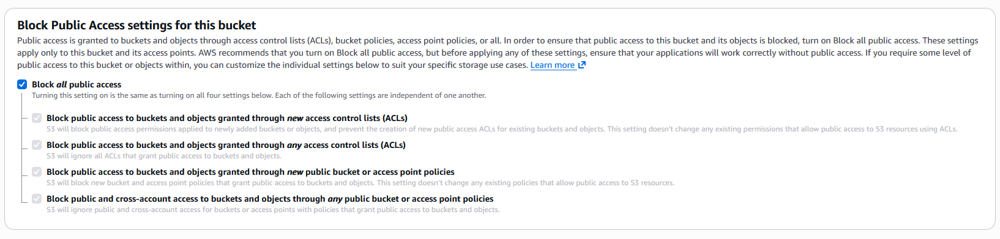
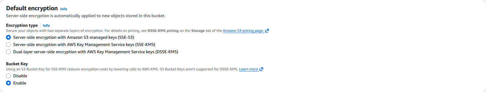

> **Disclaimer:** All IAM credentials, public IP addresses, and sensitive data shown in this writeup have been removed, and the entire AWS environment was securely cleaned up prior to publication.


# Monitoring & Logging — S3 Security Datalake

## Prerequisites

Before starting, I made sure the following were in place:

1. `projectx-prod-vpc` has been created with subnets configured
2. `projectx-prod-jumpbox` EC2 instance exists and is accessible
3. AWS CLI configured with `projectx-prod-admin` credentials
4. Your AWS username noted — it's used in the bucket name

---

## Overview

### What is Amazon S3?

**Amazon Simple Storage Service (S3)** is AWS's object storage service — designed to store and retrieve any amount of data from anywhere. It's infinitely scalable, highly durable (eleven nines — 99.999999999%), and natively integrated with almost every other AWS service.

S3 stores data as **objects** inside **buckets**. An object is a file plus its metadata. A bucket is a container for objects, tied to a specific AWS region and with a globally unique name.

Unlike a traditional file system, S3 is flat — there are no real folders or directories. What appear to be folders in the console are just object key prefixes (e.g. `cloudtrail/2026/05/log.json`). The console renders them as folders for convenience, but under the hood everything is a flat list of keyed objects.

### What is a Security Datalake?

A **security datalake** is a centralised repository for security-related logs and events from across your infrastructure. Rather than logs sitting siloed inside individual services — CloudTrail logs in one place, GuardDuty findings in another — a datalake aggregates everything into a single queryable location.

Organisations deploy security datalakes for several reasons:

- **Centralisation** — aggregate security logs from multiple AWS services in one place, making investigation and correlation easier
- **Analytics** — feed logs into analysis tools (Athena, Glue, Wazuh) for structured querying and anomaly detection
- **Long-term retention** — keep logs for compliance requirements and forensic analysis without relying on each service's default retention window
- **Cost management** — use S3 lifecycle policies to automatically move older logs to cheaper storage tiers (Standard-IA, Glacier) rather than paying full S3 pricing forever

In our setup, this S3 bucket serves as the destination for **GuardDuty findings** and **CloudTrail logs**, which will then be ingested by Wazuh for security monitoring. The detections we build in the Defenses section of this series will pull from this datalake.

---

## Step 1 — I created the S3 Bucket

I navigated to the **S3** service in the AWS Console → **Buckets** → **Create bucket**.

### Bucket Name and Region

- **Bucket name:** `projectx-prod-datalake-[username]`

> 📝 Replace `[username]` with your actual AWS username — e.g. `projectx-prod-datalake-johnsmith`. S3 bucket names must be **globally unique** across all AWS accounts and regions. If your chosen name is already taken, add a number or short suffix.

- **AWS Region:** Select the same region as your VPC (e.g. `ap-southeast-1`)

> Keep all resources in the same region to eliminate cross-region data transfer costs and reduce latency between services.

![S3 Create Bucket page showing `projectx-prod-datalake-[username]` entered as the bucket name with the correct region selected matching the VPC region.](screenshot1.png)

---

### Object Ownership

- **Object Ownership:** I selected **ACLs disabled (recommended)**

ACLs are a legacy access control mechanism. Disabling them and using bucket policies instead is the modern, recommended approach — it centralises access management and reduces misconfiguration risk.

---

### Block Public Access

For a security datalake, the bucket must be completely private. Keep all four **Block Public Access** settings **enabled**:

- Block public access to buckets and objects granted through new ACLs ✓
- Block public access to buckets and objects granted through any ACLs ✓
- Block public access to buckets and objects granted through new public bucket or access point policies ✓
- Block public and cross-account access to buckets and objects through any public bucket or access point policies ✓

> Security logs should never be publicly accessible. A public S3 bucket containing CloudTrail logs would expose your entire AWS account's API call history to anyone on the internet — exactly the kind of misconfiguration we cover in the Attacks section of this series.



---

### Bucket Versioning

- **Bucket Versioning:** **Disable**

Versioning keeps a copy of every object version, which protects against accidental deletion and overwrites. For a production security datalake, versioning is worth enabling. For this homelab, we're disabling it to keep storage costs down.

---

### Default Encryption

- **Default encryption:** Enable
- **Encryption type:** AWS managed keys (SSE-S3)

All objects stored in the bucket will be encrypted at rest using AES-256. SSE-S3 is managed entirely by AWS — no key management overhead on our side.

> For a production environment with stricter key control requirements, SSE-KMS (AWS Key Management Service) gives you a dedicated key with full audit trails of every encryption and decryption event. For this lab, SSE-S3 is sufficient.



---

### Object Lock

- **Object Lock:** Leave **disabled**

Object Lock provides WORM (Write Once, Read Many) protection — once an object is written, it cannot be modified or deleted for a defined retention period. This is valuable for strict compliance requirements (e.g. financial regulations requiring tamper-proof logs). We're skipping it for this lab.

---

### I created the Bucket

I reviewed the full configuration:

| Setting | Value |
|---|---|
| Bucket name | `projectx-prod-datalake-[username]` |
| Region | Same as VPC |
| Object Ownership | ACLs disabled |
| Block Public Access | All enabled |
| Versioning | Disabled |
| Encryption | SSE-S3 enabled |
| Object Lock | Disabled |

I selected **Create bucket**.

![S3 Buckets list showing `projectx-prod-datalake-[username]` appearing with the correct region — confirming the bucket was created successfully.](screenshot4.png)

---

## Step 2 — I created the Folder Structure

Navigate into the newly created bucket and create two folders to organise incoming logs by source:

I selected **Create folder** and create the following:

- **`guardduty/`** — will store GuardDuty threat detection findings
- **`cloudtrail/`** — will store CloudTrail API audit logs

I selected **Create folder** for each.

> 📝 As mentioned earlier, S3 doesn't have real folders — these are key prefixes. When GuardDuty and CloudTrail write objects with keys starting with `guardduty/` or `cloudtrail/`, they appear under these "folders" in the console.

![S3 bucket view showing two folders — `cloudtrail/` and `guardduty/` — listed inside `projectx-prod-datalake-[username]`, confirming the folder structure is in place.](screenshot5.png)

---

## Step 3 — Configure the Bucket Policy

GuardDuty and CloudTrail need explicit permission to write objects into your bucket. By default, S3 denies all external access — even from AWS services. We grant access using a **bucket policy**: a JSON document attached to the bucket that defines what actions which principals are allowed to perform.

Navigate to your bucket → **Permissions** tab → scroll to **Bucket policy** → **Edit**.

I pasted the following policy, replacing `[bucket-name]` with your full bucket name (e.g. `projectx-prod-datalake-johnsmith`):

> **> Note:** Be sure to change the bucket name, ARN, or Account ID in the policy below to match your own environment before pasting.

```json
{
    "Version": "2012-10-17",
    "Statement": [
        {
            "Sid": "AllowGuardDutyToWriteFindings",
            "Effect": "Allow",
            "Principal": {
                "Service": "guardduty.amazonaws.com"
            },
            "Action": "s3:PutObject",
            "Resource": "arn:aws:s3:::[bucket-name]/guardduty/*"
        },
        {
            "Sid": "AllowGuardDutyToGetBucketLocation",
            "Effect": "Allow",
            "Principal": {
                "Service": "guardduty.amazonaws.com"
            },
            "Action": "s3:GetBucketLocation",
            "Resource": "arn:aws:s3:::[bucket-name]"
        },
        {
            "Sid": "AllowCloudTrailToWriteLogs",
            "Effect": "Allow",
            "Principal": {
                "Service": "cloudtrail.amazonaws.com"
            },
            "Action": "s3:PutObject",
            "Resource": "arn:aws:s3:::[bucket-name]/cloudtrail/*",
            "Condition": {
                "StringEquals": {
                    "s3:x-amz-acl": "bucket-owner-full-control"
                }
            }
        },
        {
            "Sid": "AllowCloudTrailToGetBucketAcl",
            "Effect": "Allow",
            "Principal": {
                "Service": "cloudtrail.amazonaws.com"
            },
            "Action": "s3:GetBucketAcl",
            "Resource": "arn:aws:s3:::[bucket-name]"
        }
    ]
}
```

A quick breakdown of what this policy does:

- **GuardDuty** is allowed to `PutObject` under the `guardduty/` prefix and `GetBucketLocation` on the bucket root — the minimum it needs to export findings
- **CloudTrail** is allowed to `PutObject` under the `cloudtrail/` prefix, but only when the object is written with `bucket-owner-full-control` ACL — this ensures you retain ownership of every log object CloudTrail writes, even though CloudTrail is creating them
- **CloudTrail** also needs `GetBucketAcl` on the bucket root to validate it has write access before creating a trail

I selected **Save changes**.

---

## Step 4 — I created the Wazuh IAM Service Account

Wazuh needs its own IAM user with read access to the datalake bucket — so it can pull log files and ingest them for alerting. We create a dedicated service account user rather than reusing `projectx-prod-admin`, following the principle of least privilege.

### I created the IAM User

I navigated to **IAM → Users → Create user**.

- **Username:** `projectx-wazuh-s3-user`
- **Console access:** Not required — disable it
- **Permissions:** We'll attach a custom inline policy directly

I selected **Next → Next → Create user**.

### I created the S3 Read Policy

In the policy editor, switch to the **JSON** tab and paste the following, replacing `[AWS-BUCKET-NAME]` with your full datalake bucket name (e.g. `projectx-prod-datalake-johnsmith`):


> **> Note:** Be sure to change the bucket name, ARN, or Account ID in the policy below to match your own environment before pasting.

```json
{
    "Version": "2012-10-17",
    "Statement": [
        {
            "Sid": "WazuhS3Access",
            "Effect": "Allow",
            "Action": [
                "s3:GetObject",
                "s3:ListBucket",
                "s3:DeleteObject"
            ],
            "Resource": [
                "arn:aws:s3:::[AWS-BUCKET-NAME]/*",
                "arn:aws:s3:::[AWS-BUCKET-NAME]"
            ]
        }
    ]
}
```

What each action allows:
- `s3:GetObject` — download individual log files from the bucket
- `s3:ListBucket` — list objects in the bucket so Wazuh can discover new files
- `s3:DeleteObject` — delete log files after successful ingestion (keeps the bucket clean and avoids re-processing)

Name the policy `projectx-wazuh-s3-policy` and select **Create policy**.


---

### Attach the Policy and I created the User

Navigate back to the user creation flow. Refresh the policy list and search for `projectx-wazuh-s3-read-policy`. Select it.

I selected **Next → Create user**.


---

### Create Access Keys

I navigated to **IAM → Users → `projectx-wazuh-s3-user` → Security credentials → Create access key**.

I selected **Application running outside AWS** as the use case — this is appropriate for Wazuh running on an on-premises or EC2 VM.

I selected **Next → Create access key**.

> Copy both the **Access Key ID** and **Secret Access Key** immediately — the secret is shown only once and cannot be retrieved later. Store them securely; you'll need them in the next section.

I selected **Done**.


---

### I verified the User Configuration

I navigated to **IAM → Users → `projectx-wazuh-s3-user`** and confirm:

- `projectx-wazuh-s3-read-policy` is listed under attached policies
- One active access key is shown under Security credentials

---

## Summary

The S3 security datalake is now fully configured:

| Component | Value |
|---|---|
| Bucket | `projectx-prod-datalake-[username]` |
| Access | Fully private — all public access blocked |
| Encryption | SSE-S3 enabled on all objects |
| Folders | `guardduty/` and `cloudtrail/` prefixes created |
| Bucket Policy | GuardDuty and CloudTrail granted write permissions |
| Lifecycle Rule | Objects transition to Standard-IA after 30 days (optional) |
| Wazuh User | `projectx-wazuh-s3-user` with scoped read/list/delete access |

The datalake is ready to receive logs. The next steps — configuring CloudTrail and VPC Flow Logs — will point their log delivery at this bucket.

> 💸 **Cost reminder:** S3 costs roughly $0.023/GB/month for Standard storage. For a homelab with low log volume, this will be pennies per month. When you're done with the lab, delete all objects before deleting the bucket to avoid surprise charges — S3 bills by stored GB, not by bucket.

---

*Next up — Part 7: Wazuh Index State Management (ISM) Policy.*
