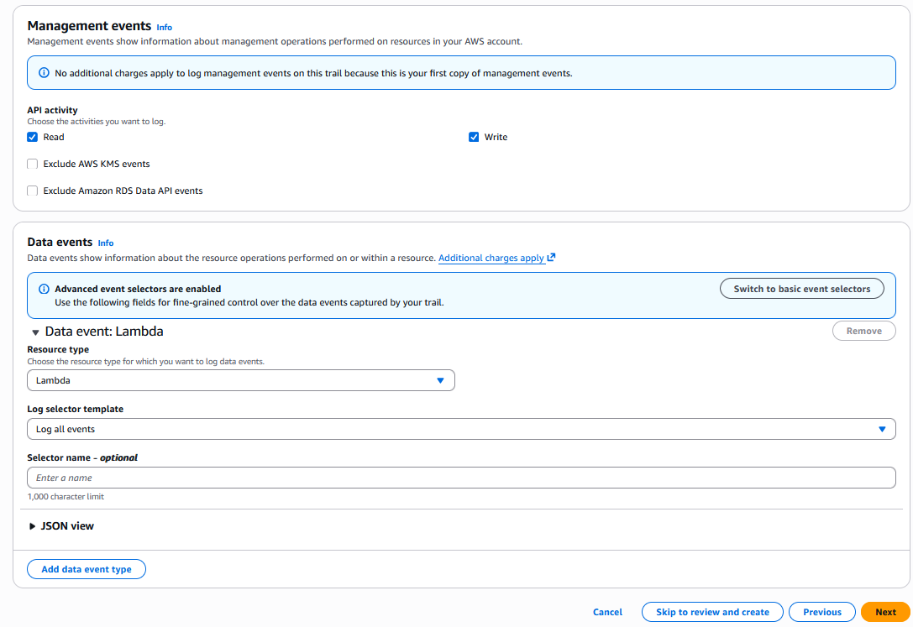
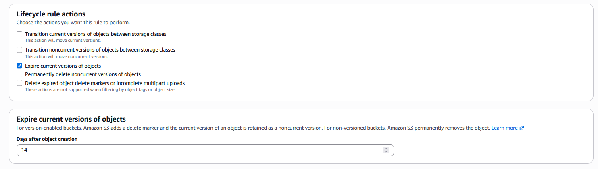

> **Disclaimer:** All IAM credentials, public IP addresses, and sensitive data shown in this writeup have been removed, and the entire AWS environment was securely cleaned up prior to publication.


# Monitoring & Logging — AWS CloudTrail & Wazuh Integration

## Prerequisites

Before starting, I made sure the following were in place:

1. `projectx-prod-vpc` has been created with subnets configured
2. `projectx-prod-jumpbox` EC2 instance exists and is accessible
3. AWS CLI configured with `projectx-prod-admin` credentials
4. `project-x-sec-box` is configured and running Wazuh 4.9.2
5. S3 datalake bucket (`projectx-prod-datalake-[username]`) has been created with the `cloudtrail/` folder
6. The S3 bucket policy is configured to allow CloudTrail to write logs (covered in the S3 Datalake guide)
7. `projectx-wazuh-s3-user` IAM service account created with access keys
8. AWS CLI configured on `project-x-sec-box` as root with the Wazuh service account credentials

> 📝 This guide is written for **Wazuh version 4.9.2**. UI elements and navigation paths may differ in other versions.

---

## Overview

### What is AWS CloudTrail?

**AWS CloudTrail** is a service that records every API call and action taken in your AWS account — regardless of whether it came from the AWS Console, CLI, SDK, or another AWS service. Every time a resource is created, modified, or deleted, CloudTrail logs who did it, when, from where, and what was changed.

CloudTrail log entries include:

- **API calls** — which service endpoint was hit and what action was performed (e.g. `RunInstances`, `DeleteBucket`, `PutRolePolicy`)
- **Identity information** — the IAM user, role, or service that made the call
- **Source IP address** — where the request originated from
- **Resource changes** — what was created, modified, or deleted and the before/after state
- **Timestamps** — exact time the action occurred in UTC

This makes CloudTrail essential for three things in a cloud environment: **security monitoring** (who did what and when), **compliance** (audit trails for regulatory requirements), and **forensic investigation** (reconstructing the timeline of an incident).

### About CloudTrail Trails

A **trail** is a CloudTrail configuration that delivers log files to an S3 bucket. You can create a trail that applies to all regions (multi-region trail) or a single region. For this lab we create a **management trail** that captures all API activity across every AWS region — meaning even if an attacker spins up resources in a region you've never used, the activity is still captured.

The trail delivers log files to our S3 datalake under the `cloudtrail/` prefix, organized by account ID, region, and date:

```
cloudtrail/AWSLogs/[account-id]/CloudTrail/[region]/[year]/[month]/[day]/
```

---

## Step 1 — I created the CloudTrail Trail

I navigated to the **CloudTrail** service in the AWS Console → **Trails** → **Create trail**.

### Trail Details

Configure the following:

- **Trail name:** `projectx-prod-management-trail`
- **Storage location:** I selected **Use an existing S3 bucket** → choose `projectx-prod-datalake-[username]`
- **S3 bucket prefix (optional):** `cloudtrail/`

> 📝 The `cloudtrail/` prefix ensures CloudTrail logs land in the dedicated folder inside your datalake bucket, keeping them separate from GuardDuty findings and any other future log sources.


### Additional Settings

- **Log file SSE-KMS encryption:** Leave **Disabled** — SSE-S3 encryption from the bucket's default encryption settings is sufficient for the lab
- **Log file validation:** Leave **Enabled** — CloudTrail generates a signed digest file alongside each log batch, which you can use to verify no log files were tampered with or deleted
- **SNS notification delivery:** Leave **Disabled**

I selected **Next**.

---

### Event Type

Configure which events to capture:

- **Event type:** Select both **Management events** and **Data events**
- **Management events:** Leave as **Read and Write** — this captures all control plane activity (IAM changes, EC2 starts/stops, S3 bucket creation, etc.)
- **Data events:** I selected **Lambda** → **Log only write events**

> **Management events** are the most important for security monitoring — they capture every administrative action taken in your account. **Data events** log individual object-level operations (S3 GetObject, PutObject, Lambda Invoke) and can generate very high log volumes, which is why we limit Lambda to write events only for this lab.



I selected **Next**.

---

### Review and Create

I reviewed the full trail configuration:

| Setting | Value |
|---|---|
| Trail name | `projectx-prod-management-trail` |
| Storage location | `projectx-prod-datalake-[username]/cloudtrail/` |
| Log file validation | Enabled |
| Management events | Read and Write |
| Data events | Lambda write events |

I selected **Create trail**.


> 📝 It may take a few minutes for CloudTrail to begin delivering log files to the S3 bucket. Logs are typically delivered within 5 minutes of API activity. If you want to trigger some immediate log entries, perform a few actions in the console — like navigating to EC2 or viewing your S3 buckets — to generate API calls that CloudTrail will capture.

---

## Step 2 — Configure an S3 Lifecycle Rule for CloudTrail Logs

To control costs and storage, we add a lifecycle rule scoped specifically to the `cloudtrail/` prefix — automatically expiring log files 14 days after creation. This is separate from the general bucket lifecycle rule and applies only to CloudTrail logs.

I navigated to **S3 → `projectx-prod-datalake-[username]` → Management tab → Lifecycle rules → Create lifecycle rule**.

### Lifecycle Rule Configuration

I configured:

- **Lifecycle rule name:** `delete-cloudtrail-logs-after-14-days`
- **Rule scope:** I selected **Limit the scope of this rule using one or more filters**
- **Prefix:** `cloudtrail/`

> 📝 Scoping the rule to the `cloudtrail/` prefix ensures it only affects CloudTrail log objects. Other data in the bucket (GuardDuty findings, future log sources) are unaffected.


### Lifecycle Action

Under **Lifecycle rule actions**, select **Expire current versions of objects**.

- **Days after object creation:** `14`

"Expire current versions" permanently deletes the current object version after 14 days. Since versioning is disabled on the bucket, this is a permanent deletion — objects cannot be recovered after expiry.



I selected **Create rule**.


---

## Step 3 — Verify CloudTrail Log Delivery

### I checked the S3 Bucket

I navigated to **S3 → `projectx-prod-datalake-[username]` → `cloudtrail/`**.

After a few minutes of activity, you should see CloudTrail delivering log files in nested folders following this path:

```
cloudtrail/
└── AWSLogs/
    └── [account-id]/
        └── CloudTrail/
            └── [region]/
                └── [year]/
                    └── [month]/
                        └── [day]/
                            └── [account-id]_CloudTrail_[region]_[timestamp].json.gz
```

Log files are compressed `.json.gz` files. Each file contains a batch of API events from a 5-minute window.

![S3 bucket view showing the `cloudtrail/AWSLogs/[account-id]/CloudTrail/` folder structure with date-based subfolders and `.json.gz` log files appearing — confirming CloudTrail is delivering logs to the datalake.](screenshot7.png)

### Verify Trail Event History

I navigated to **CloudTrail → Trails → `projectx-prod-management-trail`**.

Select the **Event history** tab. I received a list of recent API calls made in your account — including the trail creation itself, any console navigation you've done, and CLI commands run.

> Event history in the CloudTrail console shows the last 90 days of events directly in the UI. The S3 delivery is what feeds Wazuh — this view is a useful way to quickly spot-check that events are being captured before confirming the full pipeline.


---

## Step 4 — Configure the Wazuh S3 Integration

With CloudTrail logs flowing into the S3 datalake, we now configure Wazuh to pull those logs into its indexer for alerting and analysis.

### Edit the Wazuh Manager Configuration

Power on `project-x-sec-box` and log into the **Wazuh Dashboard**.

I navigated to **Server Management → Settings**.

In the configuration XML editor, locate the `<wodle name="syscollector">` block. Add the following `<wodle>` block immediately **below** it, replacing `[username]` with your actual AWS username:

```xml
<wodle name="aws-s3">
  <disabled>no</disabled>
  <interval>10m</interval>
  <run_on_start>yes</run_on_start>
  <skip_on_error>yes</skip_on_error>
  <bucket type="cloudtrail">
    <name>projectx-prod-datalake-[username]</name>
    <aws_profile>default</aws_profile>
    <path>cloudtrail/</path>
  </bucket>
</wodle>
```

A breakdown of each field:

| Field | Value | Purpose |
|---|---|---|
| `<disabled>` | `no` | Enables the integration |
| `<interval>` | `10m` | Wazuh checks the S3 bucket for new log files every 10 minutes |
| `<run_on_start>` | `yes` | Processes any unread logs immediately when the manager starts |
| `<skip_on_error>` | `yes` | Skips problematic log files rather than stopping the entire ingestion pipeline |
| `<bucket type>` | `cloudtrail` | Tells Wazuh this bucket contains CloudTrail-formatted logs |
| `<name>` | Your bucket name | The S3 bucket to pull logs from |
| `<aws_profile>` | `default` | Uses the `[default]` AWS credentials profile configured on the sec-box |
| `<path>` | `cloudtrail/` | Restricts polling to the CloudTrail prefix only |

> The `<aws_profile>default</aws_profile>` field tells Wazuh to use the credentials stored in `~/.aws/credentials` under the `[default]` profile — which is exactly what we configured as root in the ISM guide. This is why configuring the AWS CLI as root was important.


I selected **Save**.

---

### Restart the Wazuh Manager

Apply the configuration change by restarting the Wazuh manager. You can do this through the dashboard UI (**Restart Manager** button) or directly on the sec-box terminal:

```bash
sudo systemctl restart wazuh-manager
```

---

### Verify Log Ingestion

I checked the Wazuh manager logs to confirm CloudTrail logs are being picked up and processed:

```bash
sudo tail -f /var/ossec/logs/ossec.log
```

Look for entries referencing the S3 bucket and CloudTrail processing. I received lines indicating files are being fetched and events processed.


---

## Step 5 — View CloudTrail Events in Wazuh

### AWS Security Dashboard

In the Wazuh Dashboard, navigate to **Cloud security → Amazon Web Services**.

After a few minutes of log ingestion, you should see CloudTrail activity populating the AWS overview — event counts by service, top API callers, and geographic source distribution.

Adjust the time range picker in the top-right corner if no data appears immediately — set it to **Last 24 hours** or **Last 7 days** to capture any logs already ingested.

### Explore Raw Events in Discover

For deeper investigation, navigate to **Explore → Discover**.

Select the `wazuh-alerts-*` index pattern from the dropdown.

I used the search bar or add field filters to query CloudTrail events:

- `data.aws.eventName` — filter by specific API calls (e.g. `RunInstances`, `DeleteBucket`, `CreateUser`)
- `data.aws.userIdentity.userName` — filter by which IAM user performed the action
- `data.aws.sourceIPAddress` — filter by source IP to spot unusual access locations
- `data.aws.eventSource` — filter by AWS service (e.g. `iam.amazonaws.com`, `s3.amazonaws.com`)


---

## Summary

The full CloudTrail pipeline is now operational:

| Component | Details |
|---|---|
| CloudTrail Trail | `projectx-prod-management-trail` — multi-region, management + Lambda data events |
| Log Delivery | `projectx-prod-datalake-[username]/cloudtrail/AWSLogs/...` |
| Log Retention | `delete-cloudtrail-logs-after-14-days` lifecycle rule on the `cloudtrail/` prefix |
| Wazuh Integration | `aws-s3` wodle polling every 10 minutes using the `default` AWS profile |
| Visibility | CloudTrail events searchable in Wazuh via `data.aws.*` fields |

Every API action taken in your AWS account — through the console, CLI, or any service — is now being recorded, stored, and monitored. In the Defenses section of this series, we'll build Wazuh detection rules on top of these CloudTrail events to alert on specific attack patterns: IAM privilege escalation, S3 public access changes, security group modifications, and more.

---

*Next up — Part 9: AWS VPC Flow Logs & Wazuh Integration.*
