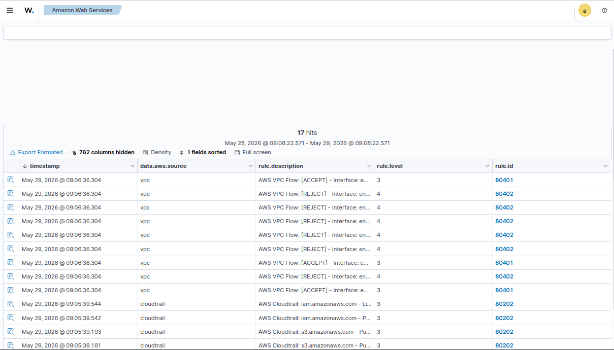

> **Disclaimer:** All IAM credentials, public IP addresses, and sensitive data shown in this writeup have been removed, and the entire AWS environment was securely cleaned up prior to publication.


# Monitoring & Logging — AWS VPC Flow Logs & Wazuh Integration

## Prerequisites

Before starting, I made sure the following were in place:

1. `projectx-prod-vpc` has been created with subnets configured
2. `projectx-prod-jumpbox` EC2 instance exists and is accessible
3. AWS CLI configured with `projectx-prod-admin` credentials
4. `project-x-sec-box` is configured and running Wazuh 4.9.2
5. S3 datalake bucket (`projectx-prod-datalake-[username]`) has been created
6. A `vpc-flow/` folder exists inside the datalake bucket
7. `projectx-wazuh-s3-user` IAM service account exists with `projectx-wazuh-s3-read-policy` attached
8. CloudTrail integration with Wazuh has been completed (previous guide)

> 📝 This guide is written for **Wazuh version 4.9.2**. UI elements and navigation paths may differ in other versions.

---

## Overview

### What are VPC Flow Logs?

**VPC Flow Logs** is an AWS feature that captures metadata about every IP traffic flow going to and from network interfaces in your VPC. Unlike CloudTrail — which records *API-level actions* (who did what in AWS) — VPC Flow Logs record *network-level traffic* (what went where at the IP and port level).

Each flow log record captures:

- **Source and destination IP addresses** — where traffic came from and where it went
- **Source and destination ports** — which ports were used
- **Protocol** — TCP, UDP, ICMP, and others by IP protocol number
- **Packet and byte counts** — volume of traffic in the flow
- **Action** — whether the traffic was `ACCEPT`ed or `REJECT`ed by security groups or network ACLs
- **Flow direction** — ingress or egress relative to the network interface

VPC Flow Logs can be enabled at three levels:

| Level | Scope |
|---|---|
| VPC | All traffic for all interfaces in the VPC |
| Subnet | All traffic for all interfaces in a specific subnet |
| Network Interface | Traffic for a single specific ENI |

For this lab we enable flow logs at the **VPC level** — capturing all traffic across every subnet and interface in `projectx-prod-vpc`. This gives us complete network visibility in one configuration.

### CloudTrail vs VPC Flow Logs

Together, these two sources give you full coverage of what's happening in your AWS environment:

| | CloudTrail | VPC Flow Logs |
|---|---|---|
| **What it captures** | AWS API calls and account activity | Network traffic flows (IP, port, protocol) |
| **Use for** | Who created/deleted/changed what | What connected to what, port scanning, data exfil |
| **Format** | JSON events | Space-delimited records |
| **Visibility** | Control plane | Network/data plane |

A real-world example: CloudTrail tells you someone called `AuthorizeSecurityGroupIngress` to open port 22 to the world. VPC Flow Logs tell you that five minutes later, there was a flood of connection attempts to port 22 from an external IP — a port scan or brute-force attempt.

---

## Step 1 — Update the Wazuh IAM Policy

Wazuh needs an additional permission — `ec2:DescribeFlowLogs` — to query VPC Flow Log metadata when processing flow log records. We add this to the existing `projectx-wazuh-s3-read-policy` that's already attached to `projectx-wazuh-s3-user`.

I navigated to **IAM → Policies** and search for `projectx-wazuh-s3-read-policy`. Select the policy name → **Edit** → switch to the **JSON** tab.

I replaced the existing policy with the updated version below, replacing `[AWS-BUCKET-NAME]` with your full datalake bucket name:

> **> Note:** Be sure to change the bucket name, ARN, or Account ID in the policy below to match your own environment before pasting.

```json
{
    "Version": "2012-10-17",
    "Statement": [
        {
            "Sid": "WazuhS3Access",
            "Effect": "Allow",
            "Action": [
                "s3:GetObject",
                "s3:ListBucket"
            ],
            "Resource": [
                "arn:aws:s3:::[AWS-BUCKET-NAME]/*",
                "arn:aws:s3:::[AWS-BUCKET-NAME]"
            ]
        },
        {
            "Sid": "WazuhVPCFlowLogsAccess",
            "Effect": "Allow",
            "Action": [
                "ec2:DescribeFlowLogs"
            ],
            "Resource": "*"
        }
    ]
}
```

What the new statement adds:

- **`ec2:DescribeFlowLogs`** — allows Wazuh to query VPC Flow Log metadata, which helps with log correlation and processing. The `Resource: "*"` is required here because `DescribeFlowLogs` is an account-level API that doesn't support resource-level scoping.

I selected **Next → Save changes**.


Navigate back to the policy and confirm both statements appear in the **Permissions** tab:

- `WazuhS3Access` — S3 GetObject and ListBucket
- `WazuhVPCFlowLogsAccess` — EC2 DescribeFlowLogs

> 📝 Because `projectx-wazuh-s3-read-policy` is attached to `projectx-wazuh-s3-user`, the updated permissions apply immediately — no changes needed on the user itself.

---

## Step 2 — I created the VPC Flow Log

I navigated to **VPC → Your VPCs** → select `projectx-prod-vpc` → **Flow logs** tab → **Create flow log**.

### Flow Log Configuration

Configure the following:

- **Flow log name:** `projectx-prod-vpc-flow-logs`
- **Filter:** **All** — captures both accepted and rejected traffic. This is the most useful setting for security monitoring since rejected traffic (port scans, blocked connection attempts) is often as informative as accepted traffic.
- **Maximum aggregation interval:** **10 minutes** — flow records are batched and delivered every 10 minutes. 1 minute is available for near-real-time visibility but generates higher log volume and cost.


### Destination

- **Destination type:** **Send to an S3 bucket**
- **S3 bucket ARN:** `arn:aws:s3:::projectx-prod-datalake-[username]/vpc-flow/`

> 📝 Replace `[username]` with your actual AWS username. The `/vpc-flow/` suffix in the ARN directs flow log files into the dedicated folder inside the datalake bucket, keeping them separate from CloudTrail logs.

- **Log record format:** **AWS default format** — the default format includes all standard flow log fields: version, account-id, interface-id, srcaddr, dstaddr, srcport, dstport, protocol, packets, bytes, start, end, action, log-status.


I selected **Create flow log**.

### Verify Flow Log Status

Navigate back to **VPC → Your VPCs → `projectx-prod-vpc` → Flow logs** tab.

The flow log `projectx-prod-vpc-flow-logs` should show a status of **Active**.

> 📝 To generate immediate flow log traffic, SSH into your jumpbox — the TCP connection will be captured as a flow and delivered to S3 within the next aggregation interval.


---

## Step 3 — Configure an S3 Lifecycle Rule for VPC Flow Logs

I added a dedicated lifecycle rule scoped to the `vpc-flow/` prefix, matching the same 14-day retention used for CloudTrail logs.

I navigated to **S3 → `projectx-prod-datalake-[username]` → Management tab → Lifecycle rules → Create lifecycle rule**.

### Configuration

- **Lifecycle rule name:** `delete-vpc-flow-logs-after-14-days`
- **Rule scope:** I selected **Limit the scope of this rule using one or more filters**
- **Prefix:** `vpc-flow/`


### Action

I selected **Expire current versions of objects**.

- **Days after object creation:** `14`

I selected **Create rule**.


> The datalake bucket now has two separate lifecycle rules — one per log source, each scoped to its own prefix. This gives you independent control: you can adjust the CloudTrail or VPC Flow Log retention window separately without affecting the other.

---

## Step 4 — Verify VPC Flow Log Delivery

### I checked the S3 Bucket

I navigated to **S3 → `projectx-prod-datalake-[username]` → `vpc-flow/`**.

After some network activity (SSHing into the jumpbox is enough), you should see flow log files appearing in nested folders:

```
vpc-flow/
└── AWSLogs/
    └── [account-id]/
        └── vpcflowlogs/
            └── [region]/
                └── [year]/
                    └── [month]/
                        └── [day]/
                            └── [account-id]_vpcflowlogs_[region]_[flow-log-id]_[timestamp].log.gz
```

Flow log files are compressed `.log.gz` files. Each file contains multiple space-delimited records — one per traffic flow.

![S3 bucket view showing the `vpc-flow/AWSLogs/[account-id]/vpcflowlogs/` folder structure with date-based subfolders and `.log.gz` flow log files appearing — confirming VPC Flow Logs are delivering to the datalake.](screenshot7.png)

### Verify Flow Log Activity in the Console

I navigated to **VPC → Your VPCs → `projectx-prod-vpc` → Flow logs** tab.

Confirm `projectx-prod-vpc-flow-logs` shows status **Active** with the S3 delivery destination visible.


---

## Step 5 — Configure the Wazuh S3 Integration

With flow logs landing in S3, we add a second `<bucket>` block to the existing Wazuh `aws-s3` wodle configuration — alongside the CloudTrail block already in place.

### Edit the Wazuh Manager Configuration

Log into the **Wazuh Dashboard** on `project-x-sec-box`.

I navigated to **Server Management → Settings**.

Find the existing `<wodle name="aws-s3">` block you added in the CloudTrail guide. I added a second `<bucket>` entry of type `vpcflow` inside the same wodle block:

```xml
<wodle name="aws-s3">
  <disabled>no</disabled>
  <interval>10m</interval>
  <run_on_start>yes</run_on_start>
  <skip_on_error>yes</skip_on_error>
  <bucket type="cloudtrail">
    <name>projectx-prod-datalake-[username]</name>
    <aws_profile>default</aws_profile>
    <path>cloudtrail/</path>
  </bucket>
  <bucket type="vpcflow">
    <name>projectx-prod-datalake-[username]</name>
    <aws_profile>default</aws_profile>
    <path>vpc-flow/</path>
  </bucket>
</wodle>
```

> 📝 Both bucket entries live inside the same `<wodle name="aws-s3">` block — no need for a second wodle. Wazuh processes each `<bucket>` element independently, polling at the same 10-minute interval using the same `default` AWS credentials profile.

Key field for the VPC Flow Logs bucket entry:

| Field | Value | Purpose |
|---|---|---|
| `type="vpcflow"` | `vpcflow` | Tells Wazuh the log format is VPC Flow Logs — it parses the space-delimited records accordingly |
| `<path>` | `vpc-flow/` | Restricts polling to the VPC Flow Logs prefix only |


I selected **Save** → **Restart Manager**.

Or restart from the terminal on `project-x-sec-box`:

```bash
sudo systemctl restart wazuh-manager
```

---

### Verify Log Ingestion

I checked the Wazuh manager log to confirm VPC Flow Logs are being picked up:

```bash
sudo tail -f /var/ossec/logs/ossec.log
```

Look for entries referencing `vpcflowlogs` or the S3 bucket fetch operations. I received both CloudTrail and VPC flow log files being processed in the same log stream.


---

## Step 6 — View VPC Flow Log Events in Wazuh

### AWS Security Dashboard

In the Wazuh Dashboard, navigate to **Cloud security → Amazon Web Services**.

VPC Flow Log data will appear alongside CloudTrail events. I received network flow counts, accepted vs rejected traffic breakdowns, and source IP distribution.

Adjust the time range if no data appears immediately — set it to **Last 24 hours** to capture any flows already ingested.



### Explore Raw Flow Records in Discover

I navigated to **Explore → Discover** and select the `wazuh-alerts-*` index pattern.

Useful fields for querying VPC Flow Log events:

- `data.aws.srcAddr` — source IP address of the flow
- `data.aws.dstAddr` — destination IP address
- `data.aws.srcPort` — source port
- `data.aws.dstPort` — destination port
- `data.aws.protocol` — IP protocol number (6 = TCP, 17 = UDP, 1 = ICMP)
- `data.aws.action` — `ACCEPT` or `REJECT`
- `data.aws.vpcEndpointId` — VPC endpoint identifier if applicable

For example, filtering on `data.aws.action: REJECT` will surface all blocked connection attempts against your VPC — a useful starting point for spotting port scans or misconfigured security group rules.


---

## Summary

The monitoring and logging stack for the ProjectX production environment is now complete:

| Component | Details |
|---|---|
| VPC Flow Log | `projectx-prod-vpc-flow-logs` — VPC-level, All traffic, 10-minute aggregation |
| Log Delivery | `projectx-prod-datalake-[username]/vpc-flow/AWSLogs/...` |
| Log Retention | `delete-vpc-flow-logs-after-14-days` lifecycle rule on `vpc-flow/` prefix |
| IAM Policy | `projectx-wazuh-s3-read-policy` updated with `ec2:DescribeFlowLogs` |
| Wazuh Integration | `type="vpcflow"` bucket block added to the existing `aws-s3` wodle |
| Visibility | Flow records searchable via `data.aws.srcAddr`, `data.aws.action`, etc. |

With both CloudTrail and VPC Flow Logs feeding into Wazuh, we now have two complementary layers of visibility:

- **CloudTrail** — the control plane: who did what to your AWS resources
- **VPC Flow Logs** — the network plane: what connected to what inside your VPC

In the Defenses section of this series, we'll build detection rules on top of both log sources — alerting on suspicious API activity from CloudTrail and anomalous network patterns from VPC Flow Logs.

---

*That wraps up the Monitoring & Logging section. Next up — Attacks: six cloud-specific attack scenarios targeting S3, EC2 metadata, API Gateway, hardcoded secrets, IAM misconfigurations, and open VPC configurations.*

*Next up — Part 10 - Attack 1: Misconfigured S3 Bucket.*
