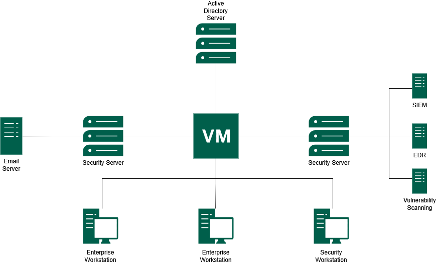
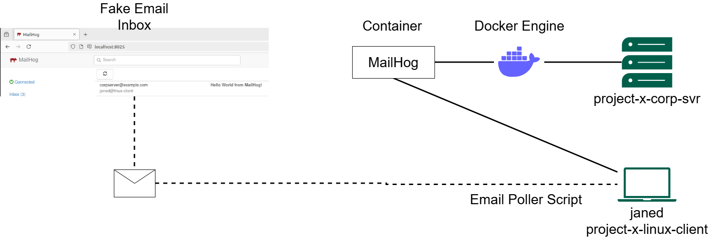
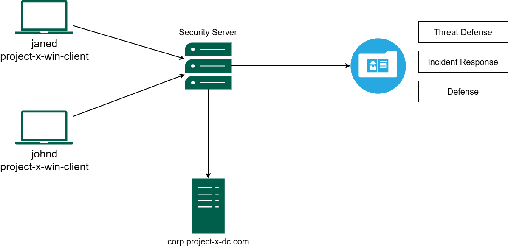

Instead of spinning up a collection of random virtual machines and calling it a homelab, I wanted to build something more meaningful - a small enterprise-like environment that I designed and built from scratch to resemble how a real corporate network is structured.

I call this the **Business-in-a-Box** homelab. The goal is to simulate a corporate domain network called **Project X**, complete with internal services, security monitoring, and an attacker node for running controlled offensive exercises.

<!--more-->

Think of it as my own self-contained training ground where I can practice both **attack** and **defence** in a realistic but isolated environment.

## Lab Architecture

I configured the entire environment to run on **Oracle VirtualBox** using a private **NAT network**: `10.0.0.0/24`.

This setup keeps my lab completely isolated from my host machine, allows me to safely execute offensive tooling, and still permits controlled outbound internet access for updates.

The architecture I built includes:

- **Active Directory infrastructure**
- **Enterprise workstations**
- **Security monitoring platforms**
- **Internal email services**
- **Offensive security systems**

### Figure 1 - Overall Homelab Architecture



*Here is the overall structure of the Business-in-a-Box homelab I built, mapping out the domain controller, my enterprise workstations, email server, security server, and the monitoring stack.*

## Virtual Machines

I provisioned each **VM** to represent a specific role commonly found in a corporate environment.

| **Hostname** | **IP Address** | **Operating System** | **Role** |
|---|---:|---|---|
| **project-x-dc** | **10.0.0.5** | Windows Server 2025 | **Domain Controller (AD/DNS/DHCP)** |
| **project-x-corp-server** | **10.0.0.8** | Ubuntu Server 22.04 | **Jumpbox & Email Server** |
| **project-x-sec-box** | **10.0.0.10** | Ubuntu Server 22.04 | **Wazuh SIEM Server** |
| **project-x-win-client** | **10.0.0.100** | Windows 11 Enterprise | **Domain Workstation** |
| **project-x-linux-client** | **10.0.0.101** | Ubuntu Desktop 22.04 | **Developer Workstation** |
| **project-x-sec-work** | **10.0.0.103** | Security Onion | **Network Monitoring Workstation** |
| **project-x-attacker** | **10.0.0.50** | Kali Linux 2024.4 | **Attacker Node** |

I allocated specifications per **VM** ranging from **1 CPU / 2 GB RAM** for lighter machines, such as the corporate server and attacker node, up to **2 CPU / 4 GB RAM** for heavier systems such as my domain controller, Windows client, and security server.

## Core Services

I integrated several core services into the homelab to make the environment behave exactly like a small enterprise network.

### Active Directory

I set up the **domain controller** on **`project-x-dc`** running **Windows Server 2025**. It provides:

- **Active Directory Domain Services (ADDS)**
- **DNS services**
- **DHCP services**
- **Centralised authentication**
- **Domain policy management**

I joined all Windows workstations in the lab to the domain **`corp.project-x-dc.com`**. This gives me centralised authentication and policy management, similar to what I would encounter in a real enterprise environment.

## Linux Domain Integration

To support a mixed operating system environment, I joined the Linux workstation to the Active Directory domain using **Samba Winbind**.

This allows my Linux systems to authenticate using domain credentials and helps me simulate a realistic environment where Windows and Linux machines coexist seamlessly.

Useful validation commands I use include:

```bash
realm list
wbinfo -u
id johnd@corp.project-x-dc.com
```

## MailHog Email Infrastructure

For the email infrastructure, I deployed **MailHog**, a lightweight tool that acts as a fake **SMTP server**. I configured it to run inside a **Docker container** on **`project-x-corp-svr`**, and it serves as the central piece for the phishing simulations I'll be running later in this series.

MailHog replaces the need for a real external email provider. This means I can keep all my email-based attack simulations fully contained inside the lab.

### MailHog ports

| **Service** | **Port** | **Purpose** |
|---|---:|---|
| **SMTP** | **1025** | Captures outgoing emails sent by my lab scripts or applications |
| **Web Interface** | **8025** | Allows me to inspect captured emails, headers, and content |
| **REST API** | N/A | Enables automated interaction for my scripted attack scenarios |

### Figure 2 - MailHog Email Simulation Workflow



*Here's how I configured MailHog to run inside Docker on `project-x-corp-svr`, alongside the custom email poller script I wrote for the Linux client to simulate realistic inbox activity.*

On the **`project-x-linux-client`** side, I created a dedicated Bash script called **`email_poller.sh`** that runs in the background and periodically polls the MailHog API to simulate a user checking their inbox. When a new email arrives, my script prints an alert to the terminal.

## Security Stack

I built the defensive side of my homelab around **Wazuh** and **Security Onion**. I use Wazuh for host-based monitoring, while Security Onion gives me full network-level visibility.

### Figure 3 - Security Monitoring and Defence Architecture



*This diagram shows how I structured the endpoint telemetry collection, forwarding all logs into my central security server where I can perform threat hunting, incident response, and defensive analysis.*

## Wazuh SIEM

**Wazuh** is the primary defensive tool I rely on in this homelab. I deployed it on **`project-x-sec-box`** using an agent-based model. I installed lightweight agents on my monitored machines to forward telemetry back to the central Wazuh Server.

The three core components I configured are:

- **Wazuh Agents** - installed on `project-x-win-client`, `project-x-linux-client`, and `project-x-dc`. I use these to monitor host-level activity such as system logs, file changes, and rootkit detection.
- **Wazuh Server** - receives all agent data, decodes logs, and runs them against a ruleset library to flag indicators of compromise.
- **Wazuh Indexer and Dashboard** - stores telemetry data and provides me with a web interface for visualising alerts and performing forensic investigations.

During my attack simulations, I use Wazuh to observe the digital footprint left behind at each stage of the attack lifecycle, from initial access to persistence.

## Security Onion

I run **Security Onion** on **`project-x-sec-work`** to complement Wazuh by giving me network-level visibility.

While I use Wazuh for host-based monitoring, I rely on Security Onion for:

- **Network Security Monitoring (NSM)**
- **Packet capture**
- **Traffic analysis**
- **Suricata alerts**
- **Zeek logs**
- **Threat hunting**

This provides me with complete visibility across the lab network, even in situations where host-based telemetry might be limited or unavailable.

## Offensive Environment

For my attacker machine, **`project-x-attacker`**, I installed **Kali Linux 2024.4** and loaded it with all the tools I use throughout the attack simulations.

| **Tool** | **Purpose** |
|---|---|
| **Hydra** | Brute-force password attacks |
| **NetExec (`nxc`)** | Credential spraying and lateral movement |
| **Evil-WinRM** | Remote shell access to Windows systems over WinRM |
| **XFreeRDP** | Remote Desktop Protocol access |
| **SecLists** | Curated wordlists for credential attacks |

I only use these tools inside my isolated homelab network for controlled security testing.

## Test Credentials

I intentionally configured weak credentials throughout the lab so that I could successfully execute my attack simulations. These credentials are strictly for my homelab use.

> **Important:** Do not use these credentials outside the lab. They are intentionally weak and I should never reuse them in real systems.

| **Account** | **Password** | **Host** |
|---|---|---|
| `Administrator` | `@Deeboodah1!` | **project-x-dc** |
| `johnd@corp.project-x-dc.com` | `@password123!` | **project-x-win-client** |
| `jane@linux-client` | `@password123!` | **project-x-linux-client** |
| `sec-user@sec-box` | `@password123!` | **project-x-sec-box** |
| `attacker` | `attacker` | **project-x-attacker** |

## Conclusion

This completes the foundational setup of my **Business-in-a-Box** cybersecurity homelab. The environment I built now includes a domain controller, enterprise workstations, internal email infrastructure, security monitoring platforms, and an attacker node.

In **Part 2**, I will deliberately misconfigure several services across the lab to create a realistically vulnerable environment and connect those activities into Wazuh so I can detect them.