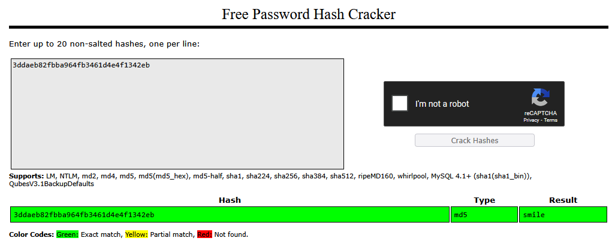
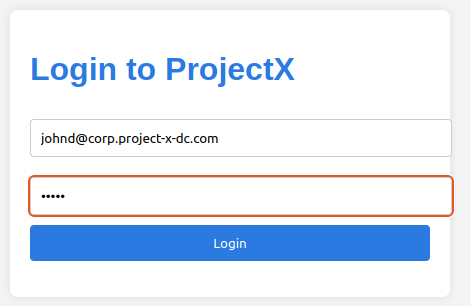
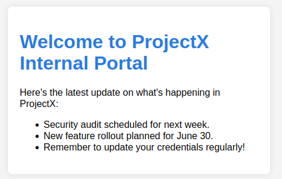

# Attack 6 — Credential Stuffing

## Prerequisites

Before starting, I made sure the following were in place:

1. VirtualBox or VMware Workstation Pro installed
2. My `project-x-win-client` is turned on and configured
3. My `project-x-corp-svr` is powered on with the `web-svr` container running
4. My `project-x-attacker` is turned on

## Scenario

In this scenario, I didn't need to be on the same network as the victim, or exploit any particular vulnerability. Instead, I obtained a list of email addresses and password hashes from a known data breach — simulated here using [HaveIBeenPwned](https://haveibeenpwned.com) — and attempted to crack them offline. Once I cracked the hash, I tested the plaintext password against my internal ProjectX web portal. Because John Doe reuses passwords across services, the same credential that was leaked in a third-party breach opened the door to my corporate portal too.

## Likeliness Meter


**Rating: High**

Credential stuffing will happen. Password reuse is extremely common — most users maintain a handful of passwords and cycle them across services. When any one of those services gets breached, every other account sharing that password is at risk. Attackers have access to enormous breach datasets, automation tools that test credentials at scale, and services like HaveIBeenPwned that make it easy to identify which accounts have been compromised. This is one of the highest-volume attack types in the wild today.

## Background: Credential Stuffing

I covered brute-force attacks and password spraying in earlier parts of this series. Credential stuffing is a related but distinct technique — and in many ways, the most realistic of the three.

**Credential stuffing** is a type of cyber attack where an attacker uses stolen username and password combinations — obtained from known data breaches or leaks — to attempt unauthorised access to other accounts. The core assumption the attacker is banking on is **password reuse**: the belief that if a user's email and password were leaked from Service A, there's a reasonable chance the same credentials will work on Service B, C, and D.

Unlike brute force, which guesses passwords randomly, or spraying, which tests a single common password across many accounts, credential stuffing works from a known dataset. The attacker already has a real username paired with a real password — they're just trying it somewhere else.

### HaveIBeenPwned

[**Have I Been Pwned (HIBP)**](https://haveibeenpwned.com) is a free online service created by security researcher Troy Hunt in 2013. It aggregates data from hundreds of publicly known data breaches and allows anyone to check whether their email address or password has appeared in a breach.

For defenders, it's a useful tool for auditing exposure. For attackers, it serves as a directory of confirmed compromised accounts — a way to narrow down which email addresses have known associated breach data, making credential stuffing campaigns more targeted and efficient.

## Security Implications

Successful credential stuffing can lead to:

- **Account takeover** — The attacker gains access to the victim's account on the targeted service, with the full permissions of the legitimate user
- **Data theft** — Sensitive data visible to the compromised account (emails, documents, personal information) is immediately accessible
- **Lateral movement** — In a corporate environment, one cracked employee account can be a stepping stone to internal systems and privileged resources
- **Reputation damage** — For organisations, credential-based breaches erode user trust and can trigger regulatory consequences

**The detection opportunity**: Unlike brute force, credential stuffing often succeeds on the first or second attempt — making volumetric login failure monitoring less reliable. More effective signals are unusual login locations, logins from unrecognised IPs or user agents, and logins at unusual hours. Multi-factor authentication (MFA) is the most impactful single control against credential stuffing: even a valid username and password combination is useless if a second factor is required.

## Running the Attack

### The Objective

I assumed `john.doe@projectxcorp.com` had appeared in a third-party data breach. I had his email address and an associated MD5 password hash. My goal was to crack that hash and use the plaintext password to log into the internal ProjectX web portal.

### Step 1 — Identify the Hash

In a real-world attack, an attacker would acquire breach data from underground forums, dark web marketplaces, or public breach dumps. For this exercise, I simulated discovering the following entry from a breach dataset:

```
john.doe@projectxcorp.com:3ddaeb82fbba964fb3461d4e4f1342eb
```

The hash `3ddaeb82fbba964fb3461d4e4f1342eb` was what I needed to crack. Before throwing it at a cracker, I narrowed down the hash type. MD5 hashes are 32 hexadecimal characters — this matched perfectly.

### Step 2 — Attempt to Crack the Hash with Hashcat

On `project-x-attacker`, I used **Hashcat** to crack the hash. The `-m 0` flag specifies MD5 mode, and I pointed it at the `rockyou.txt` wordlist:

```bash
hashcat -m 0 3ddaeb82fbba964fb3461d4e4f1342eb /usr/share/wordlists/rockyou.txt
```

>  Note: Hashcat requires GPU acceleration to run at full speed. Because my VM only had 2GB of RAM assigned, modern versions of hashcat did not run successfully. So I skipped to the online cracker in the next step.

### Step 3 — Use an Online Hash Cracker (Fallback)

Since Hashcat didn't work due to my VM resource constraints, I navigated to **[CrackStation](https://crackstation.net)** in my Kali browser and pasted the hash into the input field:

```
3ddaeb82fbba964fb3461d4e4f1342eb
```

CrackStation returned the hash type (MD5) and the cracked plaintext password.



I now had John's plaintext password.

### Step 4 — Log into the ProjectX Web Portal

I made sure `project-x-corp-svr` was powered on and the `web-svr` container was running. I also confirmed both machines were on my `project-x-network` NAT Network.

On `project-x-win-client` (or directly from my attacker machine), I opened a browser and navigated to:

```
http://10.0.0.8
```

I entered John's credentials:

- **Username:** `john.doe@projectxcorp.com`
- **Password:** (cracked plaintext from Step 3)





Access granted. John's reused password from a third-party breach opened the door to my internal corporate portal.

## Real-World Application

This was a deliberately narrow scenario — a single account, a single hash, a single target service. In reality, credential stuffing operates at scale.

Attackers acquire lists of millions of breach entries, often in plaintext or weakly hashed formats. They run automated tools that test those credentials against dozens of services simultaneously — email platforms, corporate VPNs, cloud portals, banking apps. The success rate doesn't need to be high for the attack to be profitable. Even a 0.1% hit rate against a list of 10 million accounts yields 10,000 compromised logins.

The lesson I took from this is the same one that comes up in almost every security awareness training: **don't reuse passwords**. A password manager makes this trivially easy. And from the organisation's side, MFA is the most effective technical control — a cracked password is useless if a second factor is required.

---

*Next up — Creating a C2 Server, where I build a simple command and control infrastructure in Python and deploy it to a compromised machine.*
