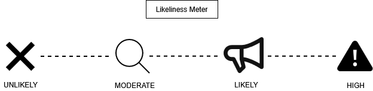
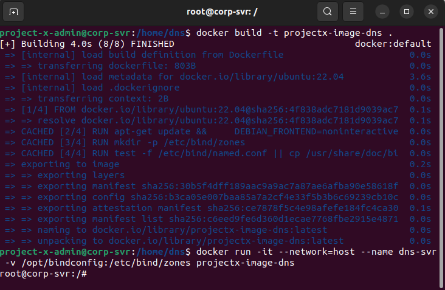
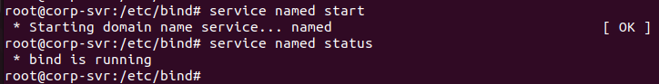
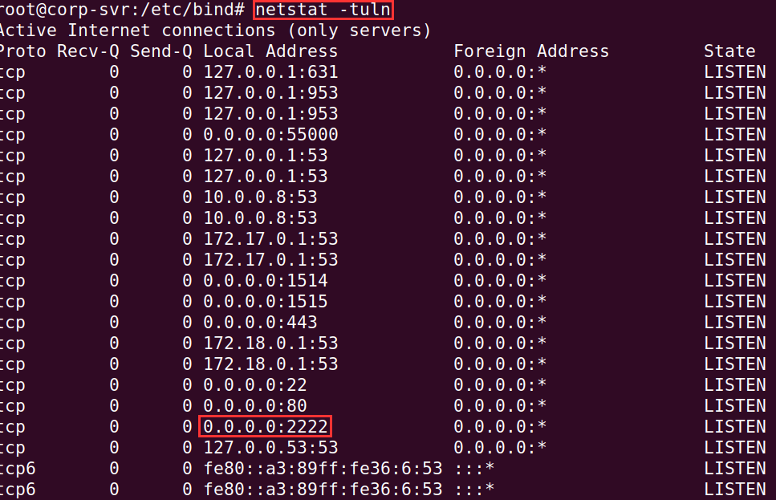
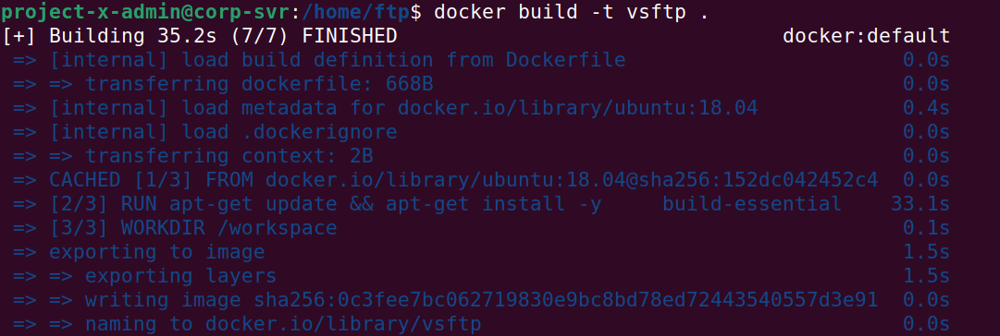
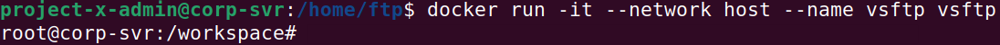
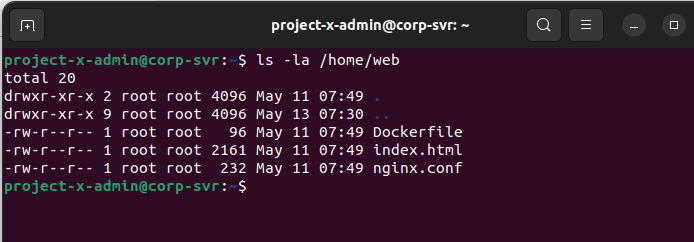
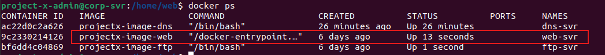
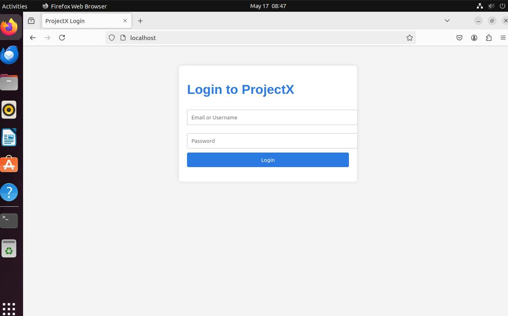
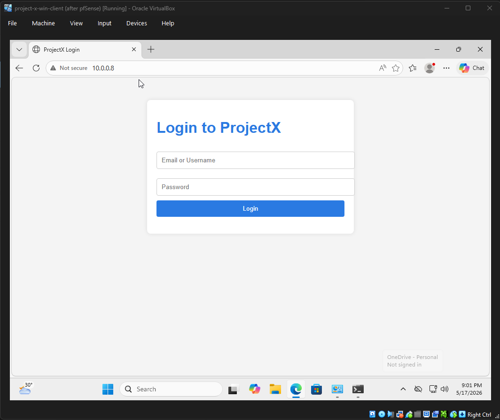

With the Enterprise 101 lab from Part 1 fully built, I'm now levelling up. **Networks & Attacks 101 (NA101)** is the next core section in my Project Security curriculum, and it's where things get more interesting - I expanded my lab's network architecture to simulate a realistic corporate environment with real services: a DNS server, an FTP server, and an internal web portal.

<!--more-->

This part focuses entirely on **setup** - I provisioned three new Docker containers that will serve as attack targets in my later exercises. Each container represents a real service you'd commonly find running in an enterprise network, and each comes with its own set of security implications I wanted to understand before the attacks come in.

My objectives were to:
- Update my existing Project X host table
- Introduce the new NA101 tools and services
- Deploy a BIND9 DNS container
- Deploy a deliberately vulnerable vsftpd container
- Deploy an NGINX internal web portal
- Prepare the lab for later network attack simulations

This setup follows the same **Business-in-a-Box** approach as my earlier homelab work: build a realistic but isolated enterprise environment first, then use it safely for offensive and defensive learning.

>  **Disclaimer:** I built this lab for cybersecurity education and defensive research purposes only. The services I set up are intentionally simplified and, in some cases, deliberately vulnerable. Do not replicate these configurations in a production environment.

## What's New in NA101

NA101 builds directly on top of my E101 topology. All my existing VMs stay the same, and all IP addresses remain unchanged from E101. The only additions are **three new Docker containers**, all hosted on `project-x-corp-server`.

### Updated Host Table

| Hostname | IP Address | Role | Course |
|---|---|---|---|
| project-x-dc | 10.0.0.5 | Domain Controller (DNS, DHCP, SSO) | E101 |
| project-x-corp-server | 10.0.0.8 | SMTP Relay + Container Host | E101 |
| project-x-sec-box | 10.0.0.10 | Dedicated Security Server (Wazuh) | E101 |
| project-x-win-client | 10.0.0.100 | Windows Workstation | E101 |
| project-x-linux-client | 10.0.0.101 | Linux Desktop Workstation | E101 |
| project-x-sec-work | 10.0.0.103 | Security Playground | E101 |
| project-x-attacker | dynamic | Attacker Environment | E101 |
|  corp-server-dns-server | 10.0.0.8:53 | DNS Server (BIND9 Container) | NA101 |
|  corp-server-ftp-server | 10.0.0.8:21 | FTP Server (vsftpd Container) | NA101 |
|  corp-server-web-server | 10.0.0.8:80 | Web Server (NGINX Container) | NA101 |

### New Credentials

All my existing credentials from E101 carry over.

## New Tools in NA101

Before diving into setup, here's a quick overview of the key tools I introduced in this section:

**Defense:**
- **pfSense** - Open-source firewall/router based on FreeBSD. Features stateful packet inspection, VPN support, DNS filtering, and traffic shaping.
- **Wireshark** - GUI-based packet capture and analysis tool for inspecting traffic at the protocol level.
- **tcpdump** - Lightweight CLI-based packet capture tool, ideal for quick on-machine traffic analysis.

> 📝 **Note:** The curriculum also covers **Suricata** (IDS/IPS) and **pfSense** (firewall/router) as part of NA101's defense stack. However, I didn't implement either in this part of the lab — I will cover them in a future post when I tackle the defenses section.

**Offense:**
- **hping3** - Packet crafting tool I use for network scanning, firewall testing, and DoS attack simulation.
- **NetImposter** - MitM tool I use for impersonating trusted network services and harvesting credentials.
- **Ettercap** - Network sniffer and MitM attack tool supporting ARP spoofing and packet injection.
- **Hashcat** - GPU-accelerated password cracking tool supporting a wide range of hash formats.

## "Likeliness" Meter

I rated each attack covered in this series on my **Likeliness Meter** — a scale that reflects how likely I think a given attack is to actually happen in the real world.



- **Unlikely** — Most likely won't happen (never say never).
- **Moderate** — Has a chance of happening given certain context and dependencies (i.e. the attacker has to be on the same WiFi network).
- **Likely** — Could happen, especially if certain conditions are met (and security controls have not been met).
- **High** — Will likely happen given conditions (i.e. brute forcing passwords on an open SSH server).

> **Why?** Security training often focuses on disparate attack tactics and techniques without disclosing whether the attack would actually be real-world. As I'm interested in the security components of these labs, I found it important to know how likely an attack were to actually happen.

## Container 1 - DNS Server (BIND9)

### What is DNS and Why Does It Matter?

DNS (Domain Name System) translates human-readable domain names like `projectxcorp.com` into IP addresses that machines use to communicate. Without it, we'd be memorising IPs instead of domain names.

I used **BIND9** (Berkeley Internet Name Domain version 9) - one of the most widely deployed DNS server implementations. It supports authoritative DNS services, recursive resolution, and zone management for both internal and internet-facing environments.

In my corporate environment, internal DNS servers like mine resolve private hostnames (e.g. domain controllers, file servers, internal apps) that should never be visible to the public internet. This separation between internal and external DNS is a critical security boundary.

**Common DNS security risks I kept in mind include:**
- DNS amplification attacks if recursion is misconfigured
- Zone transfer leaks that expose internal infrastructure
- Cache poisoning and spoofed DNS responses
- Denial-of-service attacks against DNS availability

### Setting Up the BIND9 Container

**Prerequisites:** I ensured `project-x-corp-server` had Docker configured.

I ran all steps below on `project-x-corp-server`.

**Step 1: Create the directory structure**

```bash
sudo mkdir -p /opt/bindconfig
cd /home
mkdir dns && cd dns
```


**Step 2: Create the Dockerfile**

```bash
nano Dockerfile
```

```dockerfile
FROM ubuntu:22.04

RUN apt-get update && \
    DEBIAN_FRONTEND=noninteractive apt-get install -y \
    bind9 bind9utils bind9-doc dnsutils net-tools nano \
    iputils-ping openssh-server && \
    apt-get clean

RUN mkdir -p /etc/bind/zones

RUN test -f /etc/bind/named.conf || cp /usr/share/doc/bind9/examples/named.conf /etc/bind/named.conf && \
    test -f /etc/bind/named.conf.options || cp /usr/share/doc/bind9/examples/named.conf.options /etc/bind/named.conf.options && \
    test -f /etc/bind/named.conf.local || cp /usr/share/doc/bind9/examples/named.conf.local /etc/bind/named.conf.local

CMD ["/bin/bash"]
```

**Step 3: Build and run the container**

```bash
docker build -t projectx-image-dns .
docker run -it --network=host --name dns-server -v /opt/bindconfig:/etc/bind/zones projectx-image-dns
```

> The `-v` flag binds `/opt/bindconfig` on my host to `/etc/bind/zones` inside the container. Any zone file changes I make inside the container are mirrored back to the host under `/opt/bindconfig`.



**Step 4: Configure BIND9**

Inside the container, I navigated to the BIND config directory and backed up the default files before making changes:

```bash
cd /etc/bind
mv named.conf.options named.conf.options.backup
mv named.default-zones named.default-zones.backup
```

I edited `named.conf.options` to allow recursive queries and forward unresolved requests to Google's DNS:

```bash
nano named.conf.options
```

```
options {
    directory "/var/cache/bind";
    recursion yes;
    allow-query { any; };
    allow-recursion { any; };
    listen-on { any; };
    forwarders {
        8.8.8.8;
    };
    dnssec-validation no;
    auth-nxdomain no;
};
```

I navigated to the zones directory and created the zone file:

```bash
cd /etc/bind/zones
nano db.projectxcorp.com
```

```
$TTL    604800
@       IN      SOA     ns1.projectxcorp.com. admin.projectxcorp.com. (
                              2         ; Serial
                         604800         ; Refresh
                          86400         ; Retry
                        2419200         ; Expire
                         604800 )       ; Negative Cache TTL
;
@       IN      NS      ns1.projectxcorp.com.
ns1     IN      A       10.0.0.8
www     IN      A       10.0.0.8
```

I started BIND9:

```bash
service named start
```

> If the service failed, I ran `named -g -u bind` to see the error logs in the foreground.



**Step 5: Verify DNS resolution**

From another VM (e.g. `project-x-attacker`), I verified my DNS server was resolving correctly:

```bash
dig @10.0.0.8 www.projectxcorp.com
```


**Step 6: Configure SSH and UFW on the container**

```bash
mkdir /var/run/sshd
nano /etc/ssh/sshd_config
```

I enabled `PasswordAuthentication yes` and `PermitRootLogin yes`, then set a weak root password:

```bash
echo 'root:admin' | chpasswd
service ssh start
netstat -tuln   # confirm port 2222 is listening
```

I opened port 53 via UFW:

```bash
ufw enable
ufw allow 53/tcp
ufw allow 53/udp
```



## Container 2 - FTP Server (vsftpd 2.3.4)

### What is FTP and Why Am I Using a Vulnerable Version?

FTP (File Transfer Protocol) is a legacy protocol for transferring files between a client and server over TCP/IP. It was widely used for uploading website files, storing internal documents, and automating file transfers - and I still find it running in older or less-maintained networks.

I deliberately installed **vsftpd version 2.3.4** - a version known to contain a backdoor vulnerability (**CVE-2011-2523**). This is not the official release from the vsftpd project; it's a maliciously modified version that was briefly distributed before being caught. I'll be exploiting this in a later exercise.

**Key FTP security risks I kept in mind:**
- Transmits credentials in plaintext by default
- Anonymous access misconfigurations can expose files to anyone
- Legacy versions can contain known exploits (like the one I'm setting up here)

>  This container setup is intentionally vulnerable. Credit goes to [Doctor Kisow](https://github.com/DoctorKisow/vsftpd-2.3.4) for the repository I used in this exercise.

### Setting Up the vsftpd Container

**Prerequisites:** I ensured `project-x-corp-server` had Docker configured.

**Step 1: Create directory and Dockerfile**

```bash
cd /home
mkdir ftp && cd ftp
nano Dockerfile
```

```dockerfile
FROM ubuntu:18.04

ENV DEBIAN_FRONTEND=noninteractive

RUN apt-get update && apt-get install -y \
    build-essential git wget nano curl netcat xinetd gcc make \
    libpam0g-dev libssl-dev iputils-ping iproute2 tcpdump \
    iptables vim strace lsof

WORKDIR /workspace

EXPOSE 21 6200

CMD ["/bin/bash"]
```

**Step 2: Build and run the container**

```bash
docker build -t project-x-image-ftp .
docker run -it --network host --name ftp-server project-x-image-ftp
```





**Step 3: Install vsftpd 2.3.4**

Inside the container, I cloned the vulnerable vsftpd repository:

```bash
git clone https://github.com/DoctorKisow/vsftpd-2.3.4.git
cd vsftpd-2.3.4
```

I made the find-libs script executable:

```bash
chmod +x vsf_findlibs.sh
```

I opened the `Makefile` and added `-lpam` to the end of the `LIBS` line (ensuring there was a space before it):

```bash
nano Makefile
# Find the LIBS line and append: -lpam
```

I set up required users, groups, and directories:

```bash
install -v -d -m 0755 /var/ftp/empty
install -v -d -m 0755 /home/ftp
groupadd -g 47 vsftpd
groupadd -g 48 ftp
useradd -c "vsftpd User" -d /dev/null -g vsftpd -s /bin/false -u 47 vsftpd
useradd -c anonymous_user -d /home/ftp -g ftp -s /bin/false -u 48 FTP
```

I compiled vsftpd:

```bash
make
```

I installed the binary and configuration files:

```bash
install -v -m 755 vsftpd        /usr/sbin/vsftpd
install -v -m 644 vsftpd.8      /usr/share/man/man8
install -v -m 644 vsftpd.conf.5 /usr/share/man/man5
install -v -m 644 vsftpd.conf   /etc
```

I created the empty directory required by vsftpd and set permissions:

```bash
mkdir /usr/share/empty
chmod 755 /usr/share/empty
```

**Step 4: Start vsftpd and verify**

I ran the service (it showed a blank screen - that's expected):

```bash
vsftpd
```

I opened a second terminal tab pointing to `project-x-corp-server` and verified ports 20 and 21 were listening:

```bash
netstat -tuln
```


I exited the container with `exit`. I can restart the container later when needed for the exploit exercise:

```bash
docker start ftp-server
```

## Container 3 - Web Server (NGINX)

### What is NGINX and Why Am I Deploying It?

A web server handles HTTP requests and serves content - HTML pages, APIs, images - back to the client. I used **NGINX**, one of the most widely deployed web servers in the world, to host a fake internal corporate portal for Project X called `projectxcorp.com`.

This portal will be accessible on my internal network at `http://10.0.0.8` (and later via the domain name once DNS is configured). It simulates an internal employee-facing application - the kind of thing attackers love finding on an internal network.

**Common web server security risks I considered:**
- Directory traversal exposing sensitive files
- Cross-site scripting (XSS) if user input is reflected
- Remote code execution via misconfigured interpreters
- SQL injection if dynamic content is served unsafely
- Exposed admin interfaces or default credentials

### Setting Up the NGINX Container

**Prerequisites:** I ensured `project-x-corp-server` had Docker configured and my DNS container was running.

**Step 1: Create directory and the three required files**

```bash
cd /home
mkdir web && cd web
```

**File 1: `index.html`** - The internal portal login page

```bash
nano index.html
```

```html
<!DOCTYPE html>
<html lang="en">
<head>
  <meta charset="UTF-8" />
  <title>ProjectX Login</title>
  <style>
    body { font-family: Arial, sans-serif; background: #f4f4f4; padding: 40px; }
    h1 { color: #2a7ae2; }
    .login-box, .content-box {
      background: white; padding: 20px; max-width: 400px;
      margin: auto; border-radius: 8px;
      box-shadow: 0 0 10px rgba(0,0,0,0.1);
    }
    input { width: 100%; padding: 10px; margin: 10px 0; border: 1px solid #ccc; border-radius: 4px; }
    button { width: 100%; padding: 10px; background: #2a7ae2; color: white; border: none; border-radius: 4px; cursor: pointer; }
    .error { color: red; }
  </style>
</head>
<body>

<div class="login-box" id="login-box">
  <h1>Login to ProjectX</h1>
  <input type="text" id="username" placeholder="Email or Username">
  <input type="password" id="password" placeholder="Password">
  <button onclick="login()">Login</button>
  <p class="error" id="error-msg"></p>
</div>

<div class="content-box" id="content-box" style="display:none;">
  <h1>Welcome to ProjectX Internal Portal</h1>
  <p>Here's the latest update on what's happening in ProjectX:</p>
  <ul>
    <li>Security audit scheduled for next week.</li>
    <li>New feature rollout planned for June 30.</li>
    <li>Remember to update your credentials regularly!</li>
  </ul>
</div>

<script>
  const users = {
    'Administrator': 'admin',
    'jane.doe@projectxcorp.com': 'smile',
    'john.doe@projectxcorp.com': '@password123!'
  };

  function login() {
    const username = document.getElementById('username').value.trim();
    const password = document.getElementById('password').value;
    const errorMsg = document.getElementById('error-msg');

    if (users[username] && users[username] === password) {
      document.getElementById('login-box').style.display = 'none';
      document.getElementById('content-box').style.display = 'block';
    } else {
      errorMsg.textContent = 'Invalid username or password.';
    }
  }
</script>

</body>
</html>
```

**File 2: `nginx.conf`** - NGINX server configuration

```bash
nano nginx.conf
```

```nginx
events {}

http {
    server {
        listen 80;
        # server_name projectxcorp.com;

        root /usr/share/nginx/html;
        index index.html;

        location / {
            try_files $uri $uri/ =404;
        }
    }
}
```

> Note the commented out `server_name` line. I'll uncomment this and add `projectxcorp.com` once the DNS container is fully configured and the domain is resolving correctly.

**File 3: `Dockerfile`**

```bash
nano Dockerfile
```

```dockerfile
FROM nginx:latest

COPY index.html /usr/share/nginx/html/
COPY nginx.conf /etc/nginx/nginx.conf
```



**Step 2: Build the image and run the container**

```bash
docker build -t projectx-image-web .
docker run -d --name web-server --network=host projectx-image-web
```

The `--network=host` flag attaches the container directly to my host's network interface, making my web server accessible at `http://10.0.0.8` on port 80.

I confirmed the container was running:

```bash
docker ps
```



**Step 3: Verify the portal is accessible**

I opened Firefox on `project-x-corp-server` and navigated to `http://localhost`.



I also verified it from another VM on my `10.0.0.0/24` network by navigating to `http://10.0.0.8`.



## Summary

With all three containers provisioned, my lab's "corporate" network now looks like this:

| Service | Container | Address | Technology |
|---|---|---|---|
| DNS | corp-server-dns-server | 10.0.0.8:53 | BIND9 |
| FTP | corp-server-ftp-server | 10.0.0.8:21 | vsftpd 2.3.4 (vulnerable) |
| Web | corp-server-web-server | 10.0.0.8:80 | NGINX |

Each of these services is now running on `project-x-corp-server` and reachable across my internal `10.0.0.0/24` network. More importantly - each one is intentionally misconfigured or running an outdated version, making them targets for the attack scenarios coming up in the next parts of my series.

- My **DNS server** has recursion open to all and DNSSEC disabled - a setup ripe for poisoning attacks. — **Likeliness: Moderate** (attacker needs to be on the same network segment first)
- My **FTP server** is running a version with a known remote backdoor vulnerability (CVE-2011-2523). — **Likeliness: Likely** (any network access is enough to trigger the backdoor)
- My **web server** stores credentials in client-side JavaScript with no server-side validation - a credential stuffing exercise waiting to happen. — **Likeliness: High** (credentials are readable in plain text via browser DevTools, no lockout or rate limiting)

---

*In the next parts, I'll move into the attack phase - starting with packet analysis, ARP cache poisoning, DNS zone poisoning, and eventually exploiting that vulnerable FTP server.*
