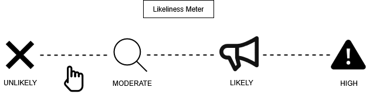
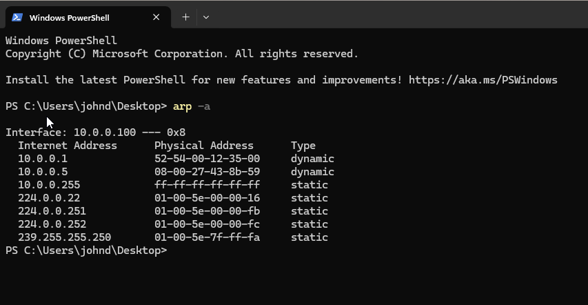
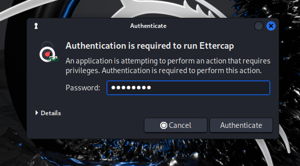
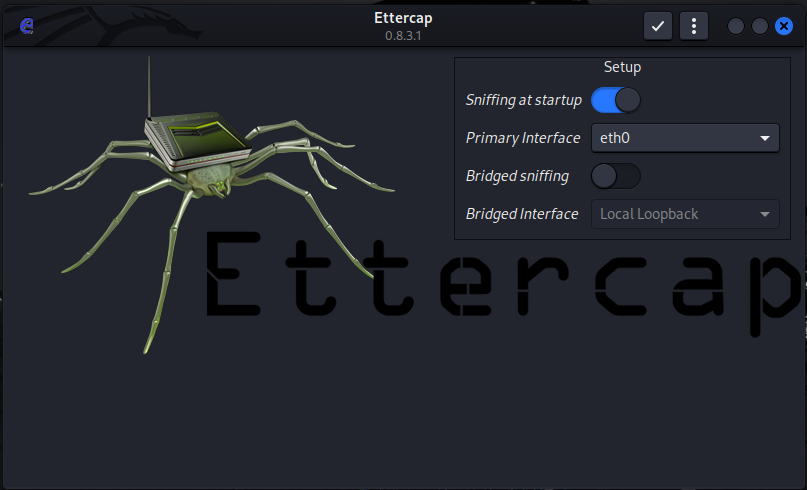
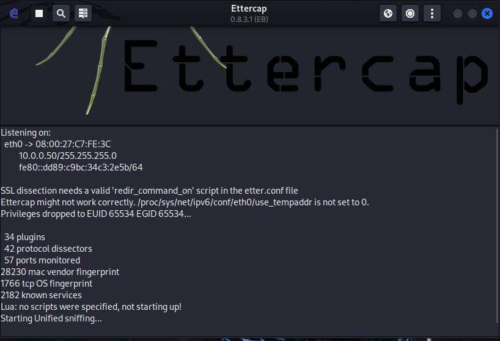
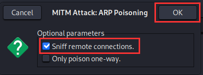

## Prerequisites

Before starting, I made sure the following were in place:

1. VirtualBox or VMware Workstation Pro installed
2. My `project-x-win-client` is turned on and configured
3. My `project-x-attacker` is turned on

## Scenario
 
In this scenario, I positioned myself as the attacker (`project-x-attacker`), already sitting on the same local network as the victim (`project-x-win-client`). Both my machines sat within the `10.0.0.0/24` subnet. I exploited the lack of authentication in the ARP protocol to associate my MAC address with the IP of a legitimate device on the network — silently inserting myself between the victim and the rest of the network without either side noticing.

## Likeliness Meter



**Rating: Moderate to Unlikely**

ARP is a Layer 2 protocol — this means an attacker must already be *inside* the local network, either physically or logically (via Wi-Fi or an already-infected endpoint). Most modern breaches are carried out remotely without the attacker needing to be locally present. End-to-end encryption is also widely used today, and the detection signals from ARP poisoning are fairly verbose — flooding ARP tables is noisy and relatively easy to spot with the right monitoring in place.

## Background: Address Resolution Protocol (ARP)

Before jumping into the attack, I wanted to understand what ARP actually does.

**Address Resolution Protocol (ARP)** is responsible for mapping IP addresses to MAC addresses on a local network. When a device wants to communicate with another device on the same LAN, it doesn't just send a packet to an IP address — it needs to know the physical MAC address of the destination. ARP handles this lookup.

Here's the basic flow I observed:

1. Device A wants to talk to `10.0.0.100` but doesn't know its MAC address
2. Device A broadcasts an ARP request to the entire network: *"Who has `10.0.0.100`? Tell me your MAC."*
3. The device at `10.0.0.100` replies with its MAC address
4. Device A stores this mapping in its **ARP cache** (also called the ARP table) for quick future reference

The ARP table is essentially a local lookup table — each device on the network maintains one, and it stores the IP-to-MAC mappings it has seen recently. This avoids having to re-broadcast ARP requests every single time a packet needs to be sent.

A key thing I noted: **ARP has no authentication**. Any device can send an ARP reply claiming any IP-to-MAC mapping, and the receiving device will accept it and update its cache accordingly. This is the root cause of the vulnerability I'm exploiting here.

## How ARP Cache Poisoning Works

ARP cache poisoning (also called ARP spoofing) exploits that lack of authentication. As the attacker, I flooded the victim's ARP table with fake ARP replies, associating my own MAC address with the IP of a legitimate device — typically the network gateway or another host.

Once I poisoned the victim's ARP cache:
- Any traffic the victim sends to `10.0.0.1` (the gateway) gets routed to my attacker machine instead
- I sit in the middle, intercepting and optionally forwarding traffic
- From the victim's perspective, everything looks normal — they can still reach the internet and local services

This is the classic **Man-in-the-Middle (MiTM)** position: I can read, modify, or drop any traffic flowing through me.

### Ettercap

I used **Ettercap** to carry out the attack. Ettercap is an open-source MiTM toolkit that ships natively with Kali Linux. It supports both active and passive eavesdropping on local network connections and provides me with a straightforward GUI for running ARP poisoning attacks without having to craft packets manually.

>  An alternative CLI-based tool called **Bettercap** can accomplish the same thing — worth exploring if you prefer a terminal-based workflow.

## Security Implications

Why would an attacker bother with ARP cache poisoning?

The primary goal is **impersonation and traffic interception**. Since the victim is typically an authorised device on the internal network, an attacker can leverage that trusted position to:

- **Intercept credentials** — If traffic is unencrypted (HTTP, FTP, plain SMTP), usernames and passwords pass through the attacker in plaintext
- **Session hijacking** — Capture session cookies to take over authenticated web sessions
- **Inject malicious content** — Modify HTTP responses in transit to serve malware or redirect to phishing pages
- **Eavesdrop on internal comms** — Read internal emails, file transfers, or API calls happening over the LAN

**The detection opportunity** is actually significant here. ARP requests and responses are not one-to-one — they broadcast out to the *entire network*. This means every device on the subnet receives my spoofed ARP broadcasts, not just my target. A sudden flood of ARP replies from an unknown MAC address mapping itself to a known IP is a strong signal that something is wrong, and it's exactly the kind of anomaly that network monitoring tools like Wireshark or Suricata can catch.

## Running the Attack

### Step 1 — Check the Victim's ARP Table (Baseline)

On `project-x-win-client`, I opened a Command Prompt and viewed the current ARP table:

```cmd
arp -a
```

I saw the standard devices on the network — my domain controller, corporate server, and other workstations — each with their correct MAC-to-IP mappings. I took note of the entry for the default gateway.



### Step 2 — Launch Ettercap on the Attacker Machine

I navigated to `project-x-attacker` (Kali Linux).

I searched for **Ettercap** in the application menu and launched it, entering the attacker's password when prompted.



In the Ettercap UI, I confirmed my **Primary Interface** was set to `eth0` — this was the interface connected to my `10.0.0.0/24` NAT network.

I clicked the ** checkmark** to start the capture.





### Step 3 — Discover Hosts

With the capture running, I navigated to **Hosts List** in the top-left menu.

Ettercap displayed the IP addresses of all reachable hosts it discovered on my local network — I could see the familiar `10.0.0.x` addresses of my lab machines.


### Step 4 — Start Wireshark Capture

Before triggering the ARP poison, I opened **Wireshark** on the Kali machine via the search bar and started a capture on `eth0`. I wanted to capture the ARP traffic in real time as my attack ran.

### Step 5 — Launch the ARP Poisoning Attack

Back in Ettercap, I went to the top-right panel and selected **MiTM → ARP Poisoning...**


A dialogue box appeared. I made sure **"Sniff remote connections."** was checked, then clicked **OK**.



I saw new messages appended to the Ettercap log panel at the bottom, confirming my ARP poisoning had begun.


### Step 6 — Observe the Attack in Wireshark

I switched back to Wireshark and stopped the capture.

I filtered for ARP traffic and examined the ARP requests and responses. Looking closely at the MAC address mappings, I could see that **`10.0.0.100`'s MAC address was now mapped to my attacker's MAC address** in the captured packets.


### Step 7 — Confirm the Poisoned ARP Table on the Victim

I navigated back to `project-x-win-client` and ran `arp -a` again:

```cmd
arp -a
```


The ARP table now showed my attacker's MAC address mapped to legitimate IP addresses in the network. The victim's device would now route traffic intended for those IPs directly to my attacker machine.

I also noticed something important from the output: **my attacker's MAC address had propagated across all other entries in the ARP table** — not just the single target IP. This is the detection footprint of the attack. Every device on my subnet received my spoofed ARP broadcasts, and a network monitor watching for unusual MAC-to-IP churn would flag this immediately.

## Conclusion

ARP cache poisoning is a foundational MiTM technique that exploits one of the oldest and most fundamental weaknesses in networking protocols — the total absence of authentication in ARP. I found the attack itself straightforward to execute with Ettercap, but its real-world applicability is limited by one hard requirement: **I had to already be on the same Layer 2 network segment as my victim**.

That constraint is why I rated this attack **Moderate to Unlikely**. In a modern enterprise environment where remote access is the norm, physically or logically landing on the internal LAN is already a significant hurdle. And once the attack was running, it was noisy — my ARP broadcasts were visible to every device on the subnet, making it one of the more detectable MiTM techniques available.

That said, it remains relevant in scenarios involving:
- Rogue insider threats already on the internal network
- Compromised devices used as a pivot point
- Unmonitored Wi-Fi networks where lateral positioning is easy

My key takeaway from the blue team side: **monitor your ARP tables**. Unexpected MAC address changes on known IP addresses, or a single MAC address associating itself with multiple IPs, are strong indicators of an ARP poisoning attempt in progress.

---

*Next up — MiTM: DNS Zone Poisoning, where I take a similar concept and apply it at the DNS layer.*
