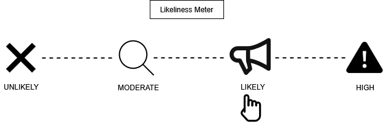
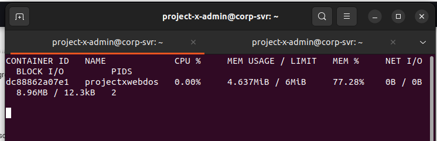
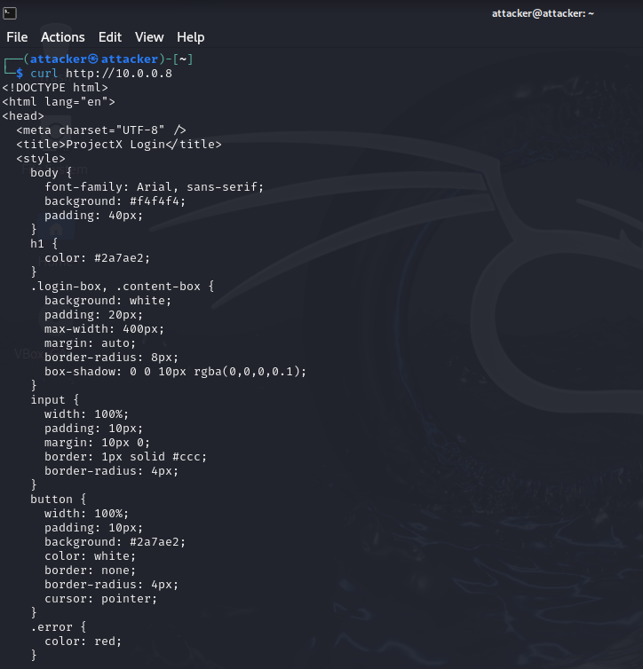
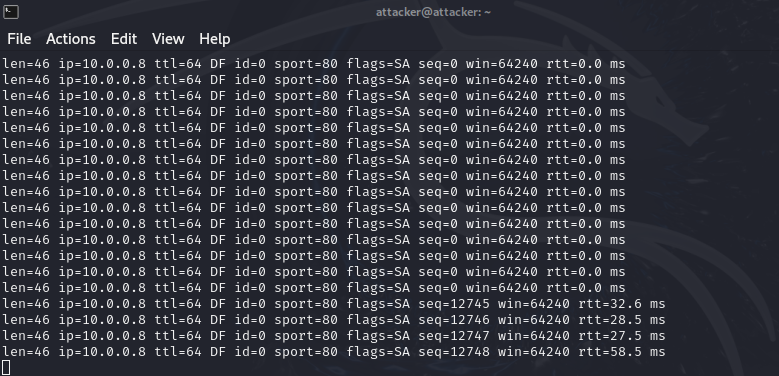
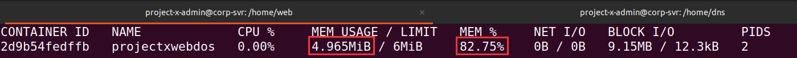
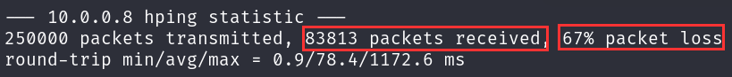

# Attack 4 — Denial of Service (DoS)

## Prerequisites

Before starting, I made sure the following were in place:

1. VirtualBox or VMware Workstation Pro installed
2. My `project-x-corp-svr` is configured with Docker
3. My Web container (`corp-server-web-server`) is set up and the `projectx-nginx` image is available
4. My `project-x-attacker` is turned on

## Scenario

In this scenario, I acted as the attacker (`project-x-attacker`) and targeted my internal web server running on `project-x-corp-svr` (`10.0.0.8`) — specifically the NGINX web container listening on port 80. Rather than trying to break in, my goal here was simpler and more blunt: flood the server with so many TCP connection requests that it could no longer respond to legitimate traffic. To make the effect observable within my lab environment, I spun up a resource-constrained version of the web container with hard limits on CPU and memory before launching the attack.

## Likeliness Meter



**Rating: Likely**

DoS and DDoS attacks will happen — especially to companies with any meaningful online presence or dependency on digital operations. The distinction is worth making: a **Distributed** DoS (DDoS) from a large botnet is the more common real-world threat and rates **High** on the likeliness scale. A singular DoS from one machine — like I performed in this exercise — rates **Likely** and is more impactful against small or under-resourced targets. The technique I used (SYN flood) is well understood, easy to execute, and doesn't require me to have any prior access to the target.

## Background: Denial of Service Attacks

Before jumping into the attack, I wanted to understand what a DoS attack actually is and the different forms it can take.

A **Denial of Service (DoS)** attack aims to overwhelm a system, network, or service with excessive traffic or resource exhaustion — making it unavailable to legitimate users. I didn't need to steal data or gain access; simply preventing the service from functioning was my goal.

There are two main categories:

- **DoS** — Originates from a single source (one machine). Effective against small or resource-limited targets.
- **DDoS (Distributed DoS)** — Leverages a large number of compromised devices, often part of a botnet, to overwhelm a target at scale. Far more powerful and the more common real-world threat.

### Types of DoS and DDoS Attacks

DoS and DDoS can be deployed in several ways depending on what layer of the network stack an attacker targets:

- **Volume-Based Attacks** — Overwhelm bandwidth with raw traffic volume. Examples: UDP floods, ICMP floods, DNS amplification.
- **Protocol Attacks** — Exploit weaknesses in network protocols to exhaust server-side resources. Examples: SYN floods, fragmented packet attacks, Ping of Death.
- **Application Layer Attacks** — Target Layer 7 (HTTP) to crash or slow down web services. Examples: HTTP GET/POST floods.

I used a **SYN flood** — a protocol attack that targets the TCP handshake process.

## How SYN Flood Works

A SYN flood exploits the way TCP establishes connections. In a normal TCP handshake:

1. The client sends a **SYN** packet to initiate a connection
2. The server responds with a **SYN-ACK** and allocates resources for the pending connection
3. The client completes the handshake with an **ACK**

In my SYN flood, I sent a massive volume of SYN packets but never sent the final ACK — either by not responding, or by using spoofed source IPs that make the ACK impossible to route back. The server keeps each of these half-open connections in memory waiting for a response that never comes. Once the backlog queue of pending connections fills up, the server can no longer accept new legitimate connections.

### hping3

I used **hping3** to carry out the attack. hping3 is a packet crafting and network testing tool that ships with Kali Linux. It allowed me precise control over the type, rate, and volume of packets sent — making it well-suited for SYN flood testing and other protocol-level exercises.

Key flags I used:

- `-S` — Send SYN packets
- `-p 80` — Target port 80 (HTTP)
- `-i u10` — Send a packet every 10 microseconds (very fast)
- `-c 250000` — Send a total of 250,000 packets

## Security Implications

Why does DoS matter?

My goal wasn't data theft or access — it was **availability disruption**. A successful DoS or DDoS attack can:

- **Take down public-facing services** — Websites, APIs, login portals, and customer-facing applications go offline
- **Disrupt internal operations** — Internal tools, VoIP, file servers, and authentication services can be knocked offline just as easily
- **Create a smokescreen** — Attackers sometimes use DoS as a distraction to draw the security team's attention while a separate, quieter attack (like lateral movement or data exfiltration) is carried out simultaneously
- **Erode customer trust** — Repeated availability incidents are damaging to reputation, especially for SaaS and e-commerce companies

**The detection opportunity**: SYN floods are volume-based and noisy — a sudden spike in half-open TCP connections on a single port is a clear anomaly. Network monitoring tools that track connection state (like Suricata or even basic firewall logs) will surface this quickly. Rate limiting and SYN cookies at the firewall or load balancer level are the standard mitigations.

## Running the Attack

### Step 1 — Spin Up the Resource-Limited Web Container

On `project-x-corp-svr`, I first stopped the existing web container if it was currently running:

```bash
docker stop web-svr
```

Then I spun up a new container called `projectxwebdos` using the same `projectx-nginx` image, but with hard limits on CPU and memory — this simulated a server with constrained resources so I could actually observe the DoS effect within the lab:

```bash
docker run -d \
  --name projectxwebdos \
  --network host \
  --cpus="0.25" \
  --memory="6m" \
  projectx-nginx
```

- `--cpus="0.25"` — limits the container to 25% of one CPU core
- `--memory="6m"` — limits the container to just 6MB of RAM


I confirmed the container was running and noted its baseline resource usage:

```bash
docker stats projectxwebdos
```



### Step 2 — Verify the Web Server is Reachable

Before launching the attack, I confirmed the target web server was up and responding normally. On `project-x-attacker`, I opened a browser or ran:

```bash
curl http://10.0.0.8
```



### Step 3 — Launch the SYN Flood from the Attacker Machine

On `project-x-attacker`, I opened a terminal and ran the hping3 SYN flood:

```bash
sudo hping3 -i u10 -S -p 80 -c 250000 10.0.0.8
```

This sent 250,000 SYN packets to port 80 on the web server at a rate of one packet every 10 microseconds — roughly 100,000 packets per second.



### Step 4 — Observe the Impact on the Container

While hping3 was running, I switched back to `project-x-corp-svr` and watched the `docker stats` output update in real time:

```bash
docker stats projectxwebdos
```

I saw the CPU and network I/O metrics start climbing noticeably as the container struggled to process the flood of incoming SYN packets.



### Step 5 — Review the hping3 Output

Once all 250,000 packets were sent, hping3 printed a summary showing the percentage of packet loss. A high packet loss figure indicated the server was dropping incoming requests — it was receiving more than it could handle and beginning to discard traffic.



### Step 6 — Clean Up

Once I was done experimenting, I stopped and removed the DoS container on `project-x-corp-svr`:

```bash
docker stop projectxwebdos
docker rm projectxwebdos
```

To bring the original web server back up:

```bash
docker start web-svr
```

## Conclusion

A DoS attack is one of the most straightforward offensive techniques in the playbook — no credentials, no exploit chain, no social engineering. Just volume. The SYN flood I ran here is considered fairly unsophisticated by modern standards, and the honest truth is that my resource-limited lab container wasn't brought completely offline — a real-world target would need to be significantly underpowered or unprotected for a single-source DoS to cause a full outage.

But that's exactly the point. What this exercise demonstrated to me was **how quickly available resources can be exhausted** when a server is dealing with half-open TCP connections it can never close. Scale this up — or distribute it across thousands of compromised nodes in a botnet — and the picture changes entirely.

The key takeaways from the blue team side: **rate limiting and SYN cookies** at the firewall or load balancer level are the first line of defence against SYN floods. Monitoring for sudden spikes in half-open TCP connections on a single port is a reliable detection signal. And for anything public-facing, a cloud-based DDoS protection layer (Cloudflare, AWS Shield) is worth the investment.

---

*Next up — Exploiting Outdated Software, where I'll take advantage of a known backdoor in vsftpd 2.3.4 (CVE-2011-2523) to gain a remote shell on my FTP container.*
